# Application Code → Bone Hotspot Call Relationship Diagram

This document shows the call relationships between cnpmcore application code and the Leoric ORM Bone hotspots.

## Summary

- **Total Bone Hotspot Nodes:** 86
- **Application Entry Points:** 17
- **Top Entry Point:** `convertModelToEntity` (173 hits)

---

## Visual Call Flow Diagram

```mermaid
flowchart TD
    subgraph Controllers["Controller Layer"]
        ShowPkg["ShowPackageController.show<br/>191 hits"]
        DownloadTar["DownloadPackageVersionTar.download<br/>48 hits"]
        BinarySync["BinarySyncController.showBinary"]
    end

    subgraph Services["Service Layer"]
        PkgMgr["PackageManagerService._listPackageFullOrAbbreviatedManifests<br/>129 hits"]
        PkgMgrCounter["PackageManagerService.savePackageVersionCounters<br/>30 hits"]
        PkgSearch["PackageSearchService.syncPackage<br/>90 hits"]
        BinarySvc["BinarySyncerService.findBinary"]
        BugVersion["BugVersionService.getBugVersion"]
        PkgVersion["PackageVersionService.getVersion"]
    end

    subgraph Repositories["Repository Layer"]
        PkgRepo["PackageRepository"]
        BinaryRepo["BinaryRepository"]
        ChangeRepo["ChangeRepository"]
        TaskRepo["TaskRepository"]
        DownloadRepo["PackageVersionDownloadRepository"]
    end

    subgraph RepoMethods["Repository Methods"]
        FindPkg["findPackage<br/>2 hits"]
        FindPkgId["findPackageId<br/>9 hits"]
        ListBinaries["listBinaries<br/>43 hits"]
        FindBinary["findBinary<br/>1 hit"]
        QueryChange["query<br/>40 hits"]
        SaveTask["saveTask<br/>2 hits"]
        Plus["plus<br/>55 hits"]
        ConvertPkgModel["_convertPackageModelToEntity<br/>4 hits"]
    end

    subgraph Convertor["ModelConvertor Utilities"]
        ConvertM2E["convertModelToEntity<br/>195 hits"]
        ConvertE2M["convertEntityToModel<br/>2 hits"]
        SaveE2M["saveEntityToModel<br/>29 hits"]
    end

    subgraph Leoric["Leoric ORM Layer"]
        FindOne["findOne → _find"]
        Create["create"]
        Save["save → _save"]
        ToObject["toObject"]
        Value["value"]
        Get["get → attribute<br/>101 hits"]
        Spell["Spell<br/>query builder"]
    end

    subgraph BoneHotspot["🔥 BONE HOTSPOT"]
        Bone["Bone Constructor<br/>3,017 hits (7.11%)"]
        SetRaw["_setRaw<br/>215 hits"]
        SetRawSaved["_setRawSaved<br/>173 hits"]
        CloneValue["cloneValue → structuredClone<br/>1,698 hits"]
    end

    %% Controller to Service
    ShowPkg --> PkgMgr
    ShowPkg --> BugVersion
    DownloadTar --> PkgMgrCounter
    BinarySync --> BinarySvc

    %% Service to Repository
    PkgMgr --> FindPkg
    PkgMgrCounter --> FindPkgId
    PkgMgrCounter --> Plus
    PkgSearch --> ListBinaries
    BinarySvc --> FindBinary
    BugVersion --> FindPkg
    PkgVersion --> BugVersion

    %% Repository to Methods
    PkgRepo --> FindPkg
    PkgRepo --> FindPkgId
    PkgRepo --> ConvertPkgModel
    BinaryRepo --> ListBinaries
    BinaryRepo --> FindBinary
    ChangeRepo --> QueryChange
    TaskRepo --> SaveTask
    DownloadRepo --> Plus

    %% Methods to Convertor
    ListBinaries --> ConvertM2E
    ConvertPkgModel --> ConvertM2E
    SaveTask --> SaveE2M

    %% Methods to Leoric
    FindPkg --> FindOne
    FindPkgId --> FindOne
    FindBinary --> FindOne
    QueryChange --> ToObject
    Plus --> Value
    Plus --> FindOne

    %% Convertor to Leoric
    ConvertM2E --> Get
    ConvertE2M --> Create
    SaveE2M --> Save

    %% Leoric to Bone
    FindOne --> Spell
    Spell --> Bone
    Create --> Bone
    Save --> Bone
    ToObject --> Get
    Value --> Bone
    Get --> Bone

    %% Bone internal
    Bone --> SetRaw
    Bone --> SetRawSaved
    Bone --> CloneValue

    %% Styling
    classDef controller fill:#e1f5fe,stroke:#01579b
    classDef service fill:#f3e5f5,stroke:#4a148c
    classDef repository fill:#e8f5e9,stroke:#1b5e20
    classDef convertor fill:#fff3e0,stroke:#e65100
    classDef leoric fill:#fce4ec,stroke:#880e4f
    classDef hotspot fill:#ffcdd2,stroke:#b71c1c,stroke-width:3px

    class ShowPkg,DownloadTar,BinarySync controller
    class PkgMgr,PkgMgrCounter,PkgSearch,BinarySvc,BugVersion,PkgVersion service
    class FindPkg,FindPkgId,ListBinaries,FindBinary,QueryChange,SaveTask,Plus,ConvertPkgModel repository
    class ConvertM2E,ConvertE2M,SaveE2M convertor
    class FindOne,Create,Save,ToObject,Value,Get,Spell leoric
    class Bone,SetRaw,SetRawSaved,CloneValue hotspot
```



---

## Top Application Entry Points to Bone

| Rank | Entry Point | Location | Hits | % |
|------|-------------|----------|------|---|
| 1 | convertModelToEntity | ModelConvertor.js:74 | 173 | 51.2% |
| 2 | plus | PackageVersionDownloadRepository.js:13 | 55 | 16.3% |
| 3 | query | ChangeRepository.js:17 | 40 | 11.8% |
| 4 | saveEntityToModel | ModelConvertor.js:50 | 29 | 8.6% |
| 5 | syncPackage | PackageSearchService.js:16 | 22 | 6.5% |
| 6 | findPackageId | PackageRepository.js:41 | 9 | 2.7% |
| 7 | _convertPackageModelToEntity | PackageRepository.js:310 | 4 | 1.2% |
| 8 | findBinary | BinaryRepository.js:27 | 2 | 0.6% |
| 9 | findPackage | PackageRepository.js:29 | 2 | 0.6% |
| 10 | convertEntityToModel | ModelConvertor.js:8 | 2 | 0.6% |

---

## Detailed Call Paths

### Path 1: listBinaries → convertModelToEntity → Bone.attribute (Most Frequent)

```
BinaryRepository.listBinaries (43 hits)
    └─▶ map callback (71 hits)
        └─▶ ModelConvertor.convertModelToEntity (195 hits)
            └─▶ bone.get() (67 hits)
                └─▶ Bone.attribute (101 hits)
```

**Analysis:** Binary listing triggers model-to-entity conversion for each row, which accesses Bone properties through getters.

### Path 2: savePackageVersionCounters → plus → Leoric queries

```
PackageManagerService.savePackageVersionCounters (30 hits)
    └─▶ PackageVersionDownloadRepository.plus (25 hits)
        ├─▶ Leoric.findOne → _find (12 hits)
        └─▶ Leoric.value (12 hits)
```

**Analysis:** Download counter saving triggers multiple database queries per package.

### Path 3: ChangeRepository.query → toObject → Bone.attribute

```
ChangeRepository.query
    └─▶ Leoric.toObject (3 hits)
        └─▶ anonymous callback (2 hits)
            └─▶ Bone.toObject (23 hits)
                └─▶ bone.get() (4 hits)
                    └─▶ Bone.attribute (11 hits)
```

**Analysis:** Change stream queries convert ORM models to plain objects, triggering property access.

---

## Bone Constructor Call Chain

The main CPU hotspot (`Bone` constructor at 7.11%) is reached through this chain:

```
Application Query (findOne, find, etc.)
    └─▶ Leoric.Spell (query builder)
        └─▶ spell.ignite() (execute query)
            └─▶ collection.init()
                └─▶ collection.dispatch() (564 hits)
                    └─▶ Bone.instantiate() (381 hits)
                        └─▶ new ContextModelClass()
                            └─▶ Bone constructor (3,017 hits) 🔥
                                ├─▶ _setRaw() (215 hits)
                                ├─▶ _setRawSaved() (173 hits)
                                └─▶ cloneValue() → structuredClone (1,698 hits)
```

---

## Recommendations

### 1. Reduce Bone Instantiation Overhead
- The Leoric v2.14.0 update (`avoids Bone constructor overhead for each row`) should help
- Consider using raw queries where full ORM features aren't needed

### 2. Optimize convertModelToEntity
- This is the #1 application entry point to Bone hotspots
- Consider caching converted entities
- Use projection queries to fetch only needed columns

### 3. Batch Database Operations
- `savePackageVersionCounters` makes multiple queries per package
- Consider batching updates

### 4. Use toJSON() Instead of Property Access
- When converting to plain objects, prefer `toJSON()` over iterating properties
- Reduces individual property getter calls

---

## View This Diagram

1. Copy the Mermaid code block above
2. Paste into [Mermaid Live Editor](https://mermaid.live)
3. Or view in any Markdown viewer that supports Mermaid (GitHub, VSCode, etc.)
