```mermaid
flowchart TD
    subgraph Application["Application Layer"]
        app_convertModelToEntity["convertModelToEntity<br/>app/repository/util/ModelConvertor.js<br/>173 hits"]
        app_plus["plus<br/>app/repository/PackageVersionDownloadRepository.js<br/>55 hits"]
        app_query["query<br/>app/repository/ChangeRepository.js<br/>40 hits"]
        app_saveEntityToModel["saveEntityToModel<br/>app/repository/util/ModelConvertor.js<br/>29 hits"]
        app_syncPackage["syncPackage<br/>app/core/service/PackageSearchService.js<br/>22 hits"]
        app_findPackageId["findPackageId<br/>app/repository/PackageRepository.js<br/>9 hits"]
        app__PackageRepository_convertPackageModelToEntity["_PackageRepository_convertPackageModelToEntity<br/>app/repository/PackageRepository.js<br/>4 hits"]
        app_findBinary["findBinary<br/>app/repository/BinaryRepository.js<br/>2 hits"]
        app_findPackage["findPackage<br/>app/repository/PackageRepository.js<br/>2 hits"]
        app_convertEntityToModel["convertEntityToModel<br/>app/repository/util/ModelConvertor.js<br/>2 hits"]
    end
    subgraph NPM["NPM Packages"]
        npm_get["get<br/>leoric@2.13.9@leoric"]
        npm_get["get<br/>leoric@2.13.9@leoric"]
        npm_attribute["attribute<br/>leoric@2.13.9@leoric"]
        npm_get["get<br/>leoric@2.13.9@leoric"]
        npm_attribute["attribute<br/>leoric@2.13.9@leoric"]
        npm_get["get<br/>leoric@2.13.9@leoric"]
        npm_get["get<br/>leoric@2.13.9@leoric"]
        npm_findOne["findOne<br/>leoric@2.13.9@leoric"]
        npm__find["_find<br/>leoric@2.13.9@leoric"]
        npm_findOne["findOne<br/>leoric@2.13.9@leoric"]
        npm__find["_find<br/>leoric@2.13.9@leoric"]
        npm_Spell["Spell<br/>leoric@2.13.9@leoric"]
        npm_get_synchronized["get synchronized<br/>leoric@2.13.9@leoric"]
        npm_Spell_dup["Spell_dup<br/>leoric@2.13.9@leoric"]
        npm__increment["$increment<br/>leoric@2.13.9@leoric"]
        npm_get_columnAttributes["get columnAttributes<br/>leoric@2.13.9@leoric"]
        npm_get["get<br/>leoric@2.13.9@leoric"]
        npm_get["get<br/>leoric@2.13.9@leoric"]
        npm_attribute["attribute<br/>leoric@2.13.9@leoric"]
        npm__anonymous_["(anonymous)<br/>@eggjs_controller-plugin@4.0.0-beta.34@@eggjs/controller-plugin"]
        npm_find["find<br/>leoric@2.13.9@leoric"]
        npm__find["_find<br/>leoric@2.13.9@leoric"]
        npm__anonymous_["(anonymous)<br/>@eggjs_controller-plugin@4.0.0-beta.34@@eggjs/controller-plugin"]
        npm__find["_find<br/>leoric@2.13.9@leoric"]
        npm_toObject["toObject<br/>leoric@2.13.9@leoric"]
        npm__anonymous_["(anonymous)<br/>leoric@2.13.9@leoric"]
        npm_toObject["toObject<br/>leoric@2.13.9@leoric"]
        npm_toObject["toObject<br/>leoric@2.13.9@leoric"]
        npm__anonymous_["(anonymous)<br/>leoric@2.13.9@leoric"]
        npm_toObject["toObject<br/>leoric@2.13.9@leoric"]
        npm_get["get<br/>leoric@2.13.9@leoric"]
        npm_toObject["toObject<br/>leoric@2.13.9@leoric"]
        npm__anonymous_["(anonymous)<br/>leoric@2.13.9@leoric"]
        npm_toObject["toObject<br/>leoric@2.13.9@leoric"]
        npm_get["get<br/>leoric@2.13.9@leoric"]
        npm_attribute["attribute<br/>leoric@2.13.9@leoric"]
        npm_save["save<br/>leoric@2.13.9@leoric"]
        npm_save["save<br/>leoric@2.13.9@leoric"]
        npm__save["_save<br/>leoric@2.13.9@leoric"]
        npm_save["save<br/>leoric@2.13.9@leoric"]
        npm__save["_save<br/>leoric@2.13.9@leoric"]
        npm_changed["changed<br/>leoric@2.13.9@leoric"]
        npm_save["save<br/>leoric@2.13.9@leoric"]
        npm__save["_save<br/>leoric@2.13.9@leoric"]
        npm_changed["changed<br/>leoric@2.13.9@leoric"]
        npm_changes["changes<br/>leoric@2.13.9@leoric"]
        npm_save["save<br/>leoric@2.13.9@leoric"]
        npm__save["_save<br/>leoric@2.13.9@leoric"]
        npm_update["update<br/>leoric@2.13.9@leoric"]
        npm_get["get<br/>leoric@2.13.9@leoric"]
        npm_get["get<br/>leoric@2.13.9@leoric"]
        npm_attribute["attribute<br/>leoric@2.13.9@leoric"]
        npm_findOne["findOne<br/>leoric@2.13.9@leoric"]
        npm__find["_find<br/>leoric@2.13.9@leoric"]
        npm_findOne["findOne<br/>leoric@2.13.9@leoric"]
        npm__find["_find<br/>leoric@2.13.9@leoric"]
        npm_Spell["Spell<br/>leoric@2.13.9@leoric"]
        npm_get_columnAttributes["get columnAttributes<br/>leoric@2.13.9@leoric"]
        npm_findOne["findOne<br/>leoric@2.13.9@leoric"]
        npm__find["_find<br/>leoric@2.13.9@leoric"]
        npm_Spell["Spell<br/>leoric@2.13.9@leoric"]
        npm_get_table["get table<br/>leoric@2.13.9@leoric"]
        npm_findOne["findOne<br/>leoric@2.13.9@leoric"]
        npm__find["_find<br/>leoric@2.13.9@leoric"]
        npm_Spell["Spell<br/>leoric@2.13.9@leoric"]
        npm_get_synchronized["get synchronized<br/>leoric@2.13.9@leoric"]
        npm_get["get<br/>leoric@2.13.9@leoric"]
        npm_findOne["findOne<br/>leoric@2.13.9@leoric"]
        npm__find["_find<br/>leoric@2.13.9@leoric"]
        npm_findOne["findOne<br/>leoric@2.13.9@leoric"]
        npm__find["_find<br/>leoric@2.13.9@leoric"]
        npm_Spell["Spell<br/>leoric@2.13.9@leoric"]
        npm_get_synchronized["get synchronized<br/>leoric@2.13.9@leoric"]
        npm_findOne["findOne<br/>leoric@2.13.9@leoric"]
        npm__find["_find<br/>leoric@2.13.9@leoric"]
        npm__anonymous_["(anonymous)<br/>@eggjs_controller-plugin@4.0.0-beta.34@@eggjs/controller-plugin"]
        npm_findOne["findOne<br/>leoric@2.13.9@leoric"]
        npm__find["_find<br/>leoric@2.13.9@leoric"]
        npm_Spell["Spell<br/>leoric@2.13.9@leoric"]
        npm_get_synchronized["get synchronized<br/>leoric@2.13.9@leoric"]
        npm_findOne["findOne<br/>leoric@2.13.9@leoric"]
        npm__find["_find<br/>leoric@2.13.9@leoric"]
        npm_Spell["Spell<br/>leoric@2.13.9@leoric"]
        npm_get_table["get table<br/>leoric@2.13.9@leoric"]
        npm_findOne["findOne<br/>leoric@2.13.9@leoric"]
        npm__find["_find<br/>leoric@2.13.9@leoric"]
        npm_Spell["Spell<br/>leoric@2.13.9@leoric"]
        npm_get_table["get table<br/>leoric@2.13.9@leoric"]
        npm_transaction["transaction<br/>leoric@2.13.9@leoric"]
        npm_create["create<br/>leoric@2.13.9@leoric"]
        npm_create["create<br/>leoric@2.13.9@leoric"]
        npm_ContextModelClass["ContextModelClass<br/>@eggjs_orm-plugin@4.0.0-beta.34@@eggjs/orm-plugin"]
        npm_Bone["Bone<br/>leoric@2.13.9@leoric"]
        bone["Bone Constructor<br/>leoric/lib/bone.js:150<br/>1553 hits"]
    end

    app_convertModelToEntity-->npm_get
    npm_get-->bone["Bone Constructor"]
    npm_get-->npm_attribute
    npm_attribute-->bone["Bone Constructor"]
    app_plus-->npm_findOne
    npm_findOne-->npm__find
    npm__find-->bone["Bone Constructor"]
    npm__find-->npm_Spell
    npm_Spell-->npm_get_synchronized
    npm_get_synchronized-->bone["Bone Constructor"]
    app_plus-->npm_Spell_dup
    npm_Spell_dup-->npm__increment
    npm__increment-->npm_get_columnAttributes
    npm_get_columnAttributes-->bone["Bone Constructor"]
    app_plus-->npm_get
    app_query-->npm__anonymous_
    npm__anonymous_-->npm_find
    npm_find-->npm__find
    npm__anonymous_-->npm__find
    app_query-->npm_toObject
    npm_toObject-->npm__anonymous_
    npm__anonymous_-->npm_toObject
    npm_toObject-->bone["Bone Constructor"]
    npm_toObject-->npm_get
    app_saveEntityToModel-->npm_save
    npm_save-->bone["Bone Constructor"]
    npm_save-->npm__save
    npm__save-->bone["Bone Constructor"]
    npm__save-->npm_changed
    npm_changed-->bone["Bone Constructor"]
    npm_changed-->npm_changes
    npm_changes-->bone["Bone Constructor"]
    npm__save-->npm_update
    npm_update-->bone["Bone Constructor"]
    app_syncPackage-->npm_get
    app_findPackageId-->npm_findOne
    npm_Spell-->npm_get_columnAttributes
    npm_Spell-->npm_get_table
    npm_get_table-->bone["Bone Constructor"]
    app_findPackageId-->npm_get
    app__PackageRepository_convertPackageModelToEntity-->npm_findOne
    app_findBinary-->npm__anonymous_
    npm__anonymous_-->npm_findOne
    app_findPackage-->npm_findOne
    app_convertEntityToModel-->npm_transaction
    npm_transaction-->npm_create
    npm_create-->bone["Bone Constructor"]
    app_convertEntityToModel-->npm_create
    npm_create-->npm_ContextModelClass
    npm_ContextModelClass-->npm_Bone
    npm_Bone-->bone["Bone Constructor"]
```

========================================================================================================================
Call Relationships: Application Code → Bone Hotspots
========================================================================================================================

Found 86 hotspot nodes matching "Bone"
Grouped into 17 application entry points

────────────────────────────────────────────────────────────────────────────────────────────────────────────────────────
## Entry Point #1: convertModelToEntity
   Location: app/repository/util/ModelConvertor.js:74
   Total Hits: 173
   Unique Paths: 6

   Top Call Paths:

   Path 1 (101 hits, 1 occurrences):
   ├─▶ [NODE] processTicksAndRejections @ node:internal/process/task_queues:72 (226 hits)
   ├─▶ [V8] runMicrotasks @ (native) (1561 hits)
   ├─▶ [APP] listBinaries @ app/repository/BinaryRepository.js:33 (43 hits)
   ├─▶ [APP] (anonymous) @ app/repository/BinaryRepository.js:47 (71 hits)
   ├─▶ [APP] convertModelToEntity @ app/repository/util/ModelConvertor.js:74 (195 hits)
   ├─▶ [NPM] get @ leoric@2.13.9@leoric:1167 (67 hits)
   └─▶ [NPM] attribute @ leoric@2.13.9@leoric:198 (101 hits)

   Path 2 (67 hits, 1 occurrences):
   ├─▶ [NODE] processTicksAndRejections @ node:internal/process/task_queues:72 (226 hits)
   ├─▶ [V8] runMicrotasks @ (native) (1561 hits)
   ├─▶ [APP] listBinaries @ app/repository/BinaryRepository.js:33 (43 hits)
   ├─▶ [APP] (anonymous) @ app/repository/BinaryRepository.js:47 (71 hits)
   ├─▶ [APP] convertModelToEntity @ app/repository/util/ModelConvertor.js:74 (195 hits)
   └─▶ [NPM] get @ leoric@2.13.9@leoric:1167 (67 hits)

   Path 3 (2 hits, 1 occurrences):
   ├─▶ [NODE] processTicksAndRejections @ node:internal/process/task_queues:72 (226 hits)
   ├─▶ [V8] runMicrotasks @ (native) (1561 hits)
   ├─▶ [APP] _PackageRepository_convertPackageModelToEntity @ app/repository/PackageRepository.js:310 (4 hits)
   ├─▶ [APP] convertModelToEntity @ app/repository/util/ModelConvertor.js:74 (11 hits)
   └─▶ [NPM] get @ leoric@2.13.9@leoric:1167 (2 hits)

────────────────────────────────────────────────────────────────────────────────────────────────────────────────────────
## Entry Point #2: plus
   Location: app/repository/PackageVersionDownloadRepository.js:13
   Total Hits: 55
   Unique Paths: 13

   Top Call Paths:

   Path 1 (12 hits, 1 occurrences):
   ├─▶ [NODE] processTicksAndRejections @ node:internal/process/task_queues:72 (226 hits)
   ├─▶ [V8] runMicrotasks @ (native) (1561 hits)
   ├─▶ [APP] plus @ app/repository/PackageVersionDownloadRepository.js:13 (25 hits)
   └─▶ [NPM] value @ leoric@2.13.9@leoric:1719 (12 hits)

   Path 2 (12 hits, 1 occurrences):
   ├─▶ [NODE] processTicksAndRejections @ node:internal/process/task_queues:72 (226 hits)
   ├─▶ [V8] runMicrotasks @ (native) (1561 hits)
   ├─▶ [APP] plus @ app/repository/PackageVersionDownloadRepository.js:13 (25 hits)
   ├─▶ [NPM] value @ leoric@2.13.9@leoric:1719 (12 hits)
   └─▶ [NPM] _find @ leoric@2.13.9@leoric:1341 (12 hits)

   Path 3 (9 hits, 1 occurrences):
   ├─▶ [NODE] processTicksAndRejections @ node:internal/process/task_queues:72 (226 hits)
   ├─▶ [V8] runMicrotasks @ (native) (1561 hits)
   ├─▶ [APP] savePackageVersionCounters @ app/core/service/PackageManagerService.js:428 (30 hits)
   ├─▶ [APP] plus @ app/repository/PackageVersionDownloadRepository.js:13 (20 hits)
   ├─▶ [NPM] findOne @ leoric@2.13.9@leoric:1377
   └─▶ [NPM] _find @ leoric@2.13.9@leoric:1341 (9 hits)

────────────────────────────────────────────────────────────────────────────────────────────────────────────────────────
## Entry Point #3: query
   Location: app/repository/ChangeRepository.js:17
   Total Hits: 40
   Unique Paths: 5

   Top Call Paths:

   Path 1 (23 hits, 1 occurrences):
   ├─▶ [NODE] processTicksAndRejections @ node:internal/process/task_queues:72 (226 hits)
   ├─▶ [V8] runMicrotasks @ (native) (1561 hits)
   ├─▶ [APP] query @ app/repository/ChangeRepository.js:17
   ├─▶ [NPM] toObject @ leoric@2.13.9@leoric:34 (3 hits)
   ├─▶ [NPM] (anonymous) @ leoric@2.13.9@leoric:35 (2 hits)
   └─▶ [NPM] toObject @ leoric@2.13.9@leoric:519 (23 hits)

   Path 2 (11 hits, 1 occurrences):
   ├─▶ [NODE] processTicksAndRejections @ node:internal/process/task_queues:72 (226 hits)
   ├─▶ [V8] runMicrotasks @ (native) (1561 hits)
   ├─▶ [APP] query @ app/repository/ChangeRepository.js:17
   ├─▶ [NPM] toObject @ leoric@2.13.9@leoric:34 (3 hits)
   ├─▶ [NPM] (anonymous) @ leoric@2.13.9@leoric:35 (2 hits)
   ├─▶ [NPM] toObject @ leoric@2.13.9@leoric:519 (23 hits)
   ├─▶ [NPM] get @ leoric@2.13.9@leoric:1167 (4 hits)
   └─▶ [NPM] attribute @ leoric@2.13.9@leoric:198 (11 hits)

   Path 3 (4 hits, 1 occurrences):
   ├─▶ [NODE] processTicksAndRejections @ node:internal/process/task_queues:72 (226 hits)
   ├─▶ [V8] runMicrotasks @ (native) (1561 hits)
   ├─▶ [APP] query @ app/repository/ChangeRepository.js:17
   ├─▶ [NPM] toObject @ leoric@2.13.9@leoric:34 (3 hits)
   ├─▶ [NPM] (anonymous) @ leoric@2.13.9@leoric:35 (2 hits)
   ├─▶ [NPM] toObject @ leoric@2.13.9@leoric:519 (23 hits)
   └─▶ [NPM] get @ leoric@2.13.9@leoric:1167 (4 hits)

────────────────────────────────────────────────────────────────────────────────────────────────────────────────────────
## Entry Point #4: saveEntityToModel
   Location: app/repository/util/ModelConvertor.js:50
   Total Hits: 29
   Unique Paths: 16

   Top Call Paths:

   Path 1 (5 hits, 1 occurrences):
   ├─▶ [NODE] processTicksAndRejections @ node:internal/process/task_queues:72 (226 hits)
   ├─▶ [V8] runMicrotasks @ (native) (1561 hits)
   ├─▶ [APP] saveTask @ app/repository/TaskRepository.js:18 (2 hits)
   ├─▶ [APP] saveEntityToModel @ app/repository/util/ModelConvertor.js:50 (12 hits)
   ├─▶ [NPM] save @ leoric@2.13.9@leoric:546 (1 hits)
   ├─▶ [NPM] _save @ leoric@2.13.9@leoric:553 (3 hits)
   ├─▶ [NPM] changed @ leoric@2.13.9@leoric:471 (2 hits)
   └─▶ [NPM] changes @ leoric@2.13.9@leoric:440 (5 hits)

   Path 2 (4 hits, 1 occurrences):
   ├─▶ [NODE] processTicksAndRejections @ node:internal/process/task_queues:72 (226 hits)
   ├─▶ [V8] runMicrotasks @ (native) (1561 hits)
   ├─▶ [APP] saveTask @ app/repository/TaskRepository.js:18 (2 hits)
   ├─▶ [APP] saveEntityToModel @ app/repository/util/ModelConvertor.js:50 (12 hits)
   ├─▶ [NPM] save @ leoric@2.13.9@leoric:546 (1 hits)
   ├─▶ [NPM] _save @ leoric@2.13.9@leoric:553 (3 hits)
   └─▶ [NPM] update @ leoric@2.13.9@leoric:710 (4 hits)

   Path 3 (3 hits, 1 occurrences):
   ├─▶ [NODE] processTicksAndRejections @ node:internal/process/task_queues:72 (226 hits)
   ├─▶ [V8] runMicrotasks @ (native) (1561 hits)
   ├─▶ [APP] saveTask @ app/repository/TaskRepository.js:18 (2 hits)
   ├─▶ [APP] saveEntityToModel @ app/repository/util/ModelConvertor.js:50 (12 hits)
   ├─▶ [NPM] save @ leoric@2.13.9@leoric:546 (1 hits)
   └─▶ [NPM] _save @ leoric@2.13.9@leoric:553 (3 hits)

────────────────────────────────────────────────────────────────────────────────────────────────────────────────────────
## Entry Point #5: syncPackage
   Location: app/core/service/PackageSearchService.js:16
   Total Hits: 22
   Unique Paths: 2

   Top Call Paths:

   Path 1 (12 hits, 1 occurrences):
   ├─▶ [NODE] processTicksAndRejections @ node:internal/process/task_queues:72 (226 hits)
   ├─▶ [V8] runMicrotasks @ (native) (1561 hits)
   ├─▶ [APP] syncPackage @ app/core/service/PackageSearchService.js:16 (90 hits)
   └─▶ [NPM] get @ leoric@2.13.9@leoric:1167 (12 hits)

   Path 2 (10 hits, 1 occurrences):
   ├─▶ [NODE] processTicksAndRejections @ node:internal/process/task_queues:72 (226 hits)
   ├─▶ [V8] runMicrotasks @ (native) (1561 hits)
   ├─▶ [APP] syncPackage @ app/core/service/PackageSearchService.js:16 (90 hits)
   ├─▶ [NPM] get @ leoric@2.13.9@leoric:1167 (12 hits)
   └─▶ [NPM] attribute @ leoric@2.13.9@leoric:198 (10 hits)

────────────────────────────────────────────────────────────────────────────────────────────────────────────────────────
## Entry Point #6: findPackageId
   Location: app/repository/PackageRepository.js:41
   Total Hits: 9
   Unique Paths: 5

   Top Call Paths:

   Path 1 (4 hits, 1 occurrences):
   ├─▶ [NODE] processTicksAndRejections @ node:internal/process/task_queues:72 (226 hits)
   ├─▶ [V8] runMicrotasks @ (native) (1561 hits)
   ├─▶ [APP] savePackageVersionCounters @ app/core/service/PackageManagerService.js:428 (30 hits)
   ├─▶ [APP] findPackageId @ app/repository/PackageRepository.js:41 (9 hits)
   ├─▶ [NPM] findOne @ leoric@2.13.9@leoric:1377
   └─▶ [NPM] _find @ leoric@2.13.9@leoric:1341 (4 hits)

   Path 2 (2 hits, 1 occurrences):
   ├─▶ [NODE] processTicksAndRejections @ node:internal/process/task_queues:72 (226 hits)
   ├─▶ [V8] runMicrotasks @ (native) (1561 hits)
   ├─▶ [APP] savePackageVersionCounters @ app/core/service/PackageManagerService.js:428 (30 hits)
   ├─▶ [APP] findPackageId @ app/repository/PackageRepository.js:41 (9 hits)
   ├─▶ [NPM] findOne @ leoric@2.13.9@leoric:1377
   ├─▶ [NPM] _find @ leoric@2.13.9@leoric:1341 (4 hits)
   ├─▶ [NPM] Spell @ leoric@2.13.9@leoric:325 (41 hits)
   └─▶ [NPM] get synchronized @ leoric@2.13.9@leoric:175 (2 hits)

   Path 3 (1 hits, 1 occurrences):
   ├─▶ [NODE] processTicksAndRejections @ node:internal/process/task_queues:72 (226 hits)
   ├─▶ [V8] runMicrotasks @ (native) (1561 hits)
   ├─▶ [APP] savePackageVersionCounters @ app/core/service/PackageManagerService.js:428 (30 hits)
   ├─▶ [APP] findPackageId @ app/repository/PackageRepository.js:41 (9 hits)
   ├─▶ [NPM] findOne @ leoric@2.13.9@leoric:1377
   ├─▶ [NPM] _find @ leoric@2.13.9@leoric:1341 (4 hits)
   ├─▶ [NPM] Spell @ leoric@2.13.9@leoric:325 (41 hits)
   └─▶ [NPM] get columnAttributes @ leoric@2.13.9@leoric:257 (1 hits)

────────────────────────────────────────────────────────────────────────────────────────────────────────────────────────
## Entry Point #7: _PackageRepository_convertPackageModelToEntity
   Location: app/repository/PackageRepository.js:310
   Total Hits: 4
   Unique Paths: 3

   Top Call Paths:

   Path 1 (2 hits, 1 occurrences):
   ├─▶ [NODE] processTicksAndRejections @ node:internal/process/task_queues:72 (226 hits)
   ├─▶ [V8] runMicrotasks @ (native) (1561 hits)
   ├─▶ [APP] _PackageRepository_convertPackageModelToEntity @ app/repository/PackageRepository.js:310 (4 hits)
   ├─▶ [NPM] findOne @ leoric@2.13.9@leoric:1377
   ├─▶ [NPM] _find @ leoric@2.13.9@leoric:1341 (1 hits)
   ├─▶ [NPM] Spell @ leoric@2.13.9@leoric:325 (3 hits)
   └─▶ [NPM] get synchronized @ leoric@2.13.9@leoric:175 (2 hits)

   Path 2 (1 hits, 1 occurrences):
   ├─▶ [NODE] processTicksAndRejections @ node:internal/process/task_queues:72 (226 hits)
   ├─▶ [V8] runMicrotasks @ (native) (1561 hits)
   ├─▶ [APP] _PackageRepository_convertPackageModelToEntity @ app/repository/PackageRepository.js:310 (4 hits)
   ├─▶ [NPM] findOne @ leoric@2.13.9@leoric:1377
   └─▶ [NPM] _find @ leoric@2.13.9@leoric:1341 (1 hits)

   Path 3 (1 hits, 1 occurrences):
   ├─▶ [NODE] processTicksAndRejections @ node:internal/process/task_queues:72 (226 hits)
   ├─▶ [V8] runMicrotasks @ (native) (1561 hits)
   ├─▶ [APP] findPackage @ app/repository/PackageRepository.js:29 (2 hits)
   ├─▶ [APP] _PackageRepository_convertPackageModelToEntity @ app/repository/PackageRepository.js:310 (2 hits)
   ├─▶ [NPM] findOne @ leoric@2.13.9@leoric:1377
   └─▶ [NPM] _find @ leoric@2.13.9@leoric:1341 (1 hits)

────────────────────────────────────────────────────────────────────────────────────────────────────────────────────────
## Entry Point #8: findBinary
   Location: app/repository/BinaryRepository.js:27
   Total Hits: 2
   Unique Paths: 1

   Top Call Paths:

   Path 1 (2 hits, 1 occurrences):
   ├─▶ [NODE] processTicksAndRejections @ node:internal/process/task_queues:72 (226 hits)
   ├─▶ [V8] runMicrotasks @ (native) (1561 hits)
   ├─▶ [NPM] (anonymous) @ @eggjs_controller-plugin@4.0.0-beta.34@@eggjs/controller-plugin:36 (198 hits)
   ├─▶ [APP] showBinary @ app/port/controller/BinarySyncController.js:38
   ├─▶ [APP] findBinary @ app/core/service/BinarySyncerService.js:30 (1 hits)
   ├─▶ [APP] findBinary @ app/repository/BinaryRepository.js:27 (1 hits)
   ├─▶ [NPM] findOne @ leoric@2.13.9@leoric:1377
   ├─▶ [NPM] _find @ leoric@2.13.9@leoric:1341
   ├─▶ [NPM] Spell @ leoric@2.13.9@leoric:325 (11 hits)
   └─▶ [NPM] get synchronized @ leoric@2.13.9@leoric:175 (2 hits)

────────────────────────────────────────────────────────────────────────────────────────────────────────────────────────
## Entry Point #9: findPackage
   Location: app/repository/PackageRepository.js:29
   Total Hits: 2
   Unique Paths: 2

   Top Call Paths:

   Path 1 (1 hits, 1 occurrences):
   ├─▶ [NODE] processTicksAndRejections @ node:internal/process/task_queues:72 (226 hits)
   ├─▶ [V8] runMicrotasks @ (native) (1561 hits)
   ├─▶ [APP] show @ app/port/controller/package/ShowPackageController.js:20 (191 hits)
   ├─▶ [APP] listPackageFullManifests @ app/core/service/PackageManagerService.js:368
   ├─▶ [APP] _listPackageFullOrAbbreviatedManifests @ app/core/service/PackageManagerService.js:806 (1 hits)
   ├─▶ [APP] findPackage @ app/repository/PackageRepository.js:29
   ├─▶ [NPM] findOne @ leoric@2.13.9@leoric:1377
   ├─▶ [NPM] _find @ leoric@2.13.9@leoric:1341
   ├─▶ [NPM] Spell @ leoric@2.13.9@leoric:325 (9 hits)
   └─▶ [NPM] get table @ leoric@2.13.9@leoric:1109 (1 hits)

   Path 2 (1 hits, 1 occurrences):
   ├─▶ [NODE] processTicksAndRejections @ node:internal/process/task_queues:72 (226 hits)
   ├─▶ [V8] runMicrotasks @ (native) (1561 hits)
   ├─▶ [APP] getVersion @ app/core/service/PackageVersionService.js:67 (2 hits)
   ├─▶ [APP] getBugVersion @ app/core/service/BugVersionService.js:16
   ├─▶ [APP] findPackage @ app/repository/PackageRepository.js:29
   ├─▶ [NPM] findOne @ leoric@2.13.9@leoric:1377
   ├─▶ [NPM] _find @ leoric@2.13.9@leoric:1341
   ├─▶ [NPM] Spell @ leoric@2.13.9@leoric:325 (1 hits)
   └─▶ [NPM] get table @ leoric@2.13.9@leoric:1109 (1 hits)

────────────────────────────────────────────────────────────────────────────────────────────────────────────────────────
## Entry Point #10: convertEntityToModel
   Location: app/repository/util/ModelConvertor.js:8
   Total Hits: 2
   Unique Paths: 2

   Top Call Paths:

   Path 1 (1 hits, 1 occurrences):
   ├─▶ [NODE] processTicksAndRejections @ node:internal/process/task_queues:72 (226 hits)
   ├─▶ [V8] runMicrotasks @ (native) (1561 hits)
   ├─▶ [NPM] transaction @ leoric@2.13.9@leoric:1580
   ├─▶ [APP] (anonymous) @ app/repository/PackageRepository.js:138
   ├─▶ [APP] convertEntityToModel @ app/repository/util/ModelConvertor.js:8
   └─▶ [NPM] create @ leoric@2.13.9@leoric:1404 (1 hits)

   Path 2 (1 hits, 1 occurrences):
   ├─▶ [NODE] processTicksAndRejections @ node:internal/process/task_queues:72 (226 hits)
   ├─▶ [V8] runMicrotasks @ (native) (1561 hits)
   ├─▶ [APP] saveTaskToHistory @ app/repository/TaskRepository.js:57 (1 hits)
   ├─▶ [APP] convertEntityToModel @ app/repository/util/ModelConvertor.js:8
   ├─▶ [NPM] create @ leoric@2.13.9@leoric:1404
   ├─▶ [NPM] ContextModelClass @ @eggjs_orm-plugin@4.0.0-beta.34@@eggjs/orm-plugin:17
   └─▶ [NPM] Bone @ leoric@2.13.9@leoric:150 (1 hits)

────────────────────────────────────────────────────────────────────────────────────────────────────────────────────────
## Entry Point #11: findPackageTag
   Location: app/repository/PackageRepository.js:274
   Total Hits: 1
   Unique Paths: 1

   Top Call Paths:

   Path 1 (1 hits, 1 occurrences):
   ├─▶ [NODE] processTicksAndRejections @ node:internal/process/task_queues:72 (226 hits)
   ├─▶ [V8] runMicrotasks @ (native) (1561 hits)
   ├─▶ [APP] getBugVersion @ app/core/service/BugVersionService.js:16 (2 hits)
   ├─▶ [APP] findPackageTag @ app/repository/PackageRepository.js:274 (1 hits)
   ├─▶ [NPM] findOne @ leoric@2.13.9@leoric:1377
   ├─▶ [NPM] _find @ leoric@2.13.9@leoric:1341
   ├─▶ [NPM] Spell @ leoric@2.13.9@leoric:325 (1 hits)
   └─▶ [NPM] get synchronized @ leoric@2.13.9@leoric:175 (1 hits)

────────────────────────────────────────────────────────────────────────────────────────────────────────────────────────
## Entry Point #12: findMaxSatisfyVersion
   Location: app/repository/PackageVersionRepository.js:53
   Total Hits: 1
   Unique Paths: 1

   Top Call Paths:

   Path 1 (1 hits, 1 occurrences):
   ├─▶ [NODE] processTicksAndRejections @ node:internal/process/task_queues:72 (226 hits)
   ├─▶ [V8] runMicrotasks @ (native) (1561 hits)
   ├─▶ [APP] getVersion @ app/core/service/PackageVersionService.js:67 (2 hits)
   ├─▶ [APP] findMaxSatisfyVersion @ app/repository/PackageVersionRepository.js:53
   ├─▶ [NPM] value @ leoric@2.13.9@leoric:1719
   ├─▶ [NPM] _find @ leoric@2.13.9@leoric:1341
   ├─▶ [NPM] Spell @ leoric@2.13.9@leoric:325
   └─▶ [NPM] get synchronized @ leoric@2.13.9@leoric:175 (1 hits)

────────────────────────────────────────────────────────────────────────────────────────────────────────────────────────
## Entry Point #13: findRegistryByRegistryHost
   Location: app/repository/RegistryRepository.js:39
   Total Hits: 1
   Unique Paths: 1

   Top Call Paths:

   Path 1 (1 hits, 1 occurrences):
   ├─▶ [NODE] processTicksAndRejections @ node:internal/process/task_queues:72 (226 hits)
   ├─▶ [V8] runMicrotasks @ (native) (1561 hits)
   ├─▶ [APP] executeTask @ app/core/service/PackageSyncerService.js:298 (4 hits)
   ├─▶ [APP] syncUpstream @ app/core/service/PackageSyncerService.js:106
   ├─▶ [APP] getAuthTokenByRegistryHost @ app/core/service/RegistryManagerService.js:123
   ├─▶ [APP] findByRegistryHost @ app/core/service/RegistryManagerService.js:76
   ├─▶ [APP] findRegistryByRegistryHost @ app/repository/RegistryRepository.js:39
   ├─▶ [NPM] findOne @ leoric@2.13.9@leoric:1377
   └─▶ [NPM] _find @ leoric@2.13.9@leoric:1341 (1 hits)

────────────────────────────────────────────────────────────────────────────────────────────────────────────────────────
## Entry Point #14: fillPackageVersionEntityData
   Location: app/repository/PackageRepository.js:259
   Total Hits: 1
   Unique Paths: 1

   Top Call Paths:

   Path 1 (1 hits, 1 occurrences):
   ├─▶ [NODE] processTicksAndRejections @ node:internal/process/task_queues:72 (226 hits)
   ├─▶ [V8] runMicrotasks @ (native) (1561 hits)
   ├─▶ [APP] findPackageVersion @ app/repository/PackageRepository.js:172
   ├─▶ [APP] fillPackageVersionEntityData @ app/repository/PackageRepository.js:259 (2 hits)
   ├─▶ [NPM] get @ leoric@2.13.9@leoric:1167
   └─▶ [NPM] attribute @ leoric@2.13.9@leoric:198 (1 hits)

────────────────────────────────────────────────────────────────────────────────────────────────────────────────────────
## Entry Point #15: showPackageDownloads
   Location: app/port/controller/DownloadController.js:20
   Total Hits: 1
   Unique Paths: 1

   Top Call Paths:

   Path 1 (1 hits, 1 occurrences):
   ├─▶ [NODE] processTicksAndRejections @ node:internal/process/task_queues:72 (226 hits)
   ├─▶ [V8] runMicrotasks @ (native) (1561 hits)
   ├─▶ [APP] showPackageDownloads @ app/port/controller/DownloadController.js:20 (8 hits)
   ├─▶ [NPM] get @ leoric@2.13.9@leoric:1167
   └─▶ [NPM] attribute @ leoric@2.13.9@leoric:198 (1 hits)

────────────────────────────────────────────────────────────────────────────────────────────────────────────────────────
## Entry Point #16: saveTask
   Location: app/repository/TaskRepository.js:18
   Total Hits: 1
   Unique Paths: 1

   Top Call Paths:

   Path 1 (1 hits, 1 occurrences):
   ├─▶ [NODE] processTicksAndRejections @ node:internal/process/task_queues:72 (226 hits)
   ├─▶ [V8] runMicrotasks @ (native) (1561 hits)
   ├─▶ [APP] appendTaskLog @ app/core/service/TaskService.js:138
   ├─▶ [APP] saveTask @ app/repository/TaskRepository.js:18
   ├─▶ [NPM] findOne @ leoric@2.13.9@leoric:1377
   └─▶ [NPM] _find @ leoric@2.13.9@leoric:1341 (1 hits)

────────────────────────────────────────────────────────────────────────────────────────────────────────────────────────
## Entry Point #17: idempotentSaveTask
   Location: app/repository/TaskRepository.js:48
   Total Hits: 1
   Unique Paths: 1

   Top Call Paths:

   Path 1 (1 hits, 1 occurrences):
   ├─▶ [NODE] processTicksAndRejections @ node:internal/process/task_queues:72 (226 hits)
   ├─▶ [V8] runMicrotasks @ (native) (1561 hits)
   ├─▶ [APP] findExecuteTask @ app/core/service/TaskService.js:77
   ├─▶ [APP] idempotentSaveTask @ app/repository/TaskRepository.js:48
   ├─▶ [NPM] update @ leoric@2.13.9@leoric:1496
   ├─▶ [NPM] ContextModelClass @ @eggjs_orm-plugin@4.0.0-beta.34@@eggjs/orm-plugin:17
   └─▶ [NPM] Bone @ leoric@2.13.9@leoric:150 (1 hits)

────────────────────────────────────────────────────────────────────────────────────────────────────────────────────────
## Paths without Application Code: 24 paths, 3912 total hits
   (These are triggered by Node.js internals, timers, or async operations)

════════════════════════════════════════════════════════════════════════════════════════════════════════════════════════
MERMAID FLOWCHART (copy to https://mermaid.live)
════════════════════════════════════════════════════════════════════════════════════════════════════════════════════════

