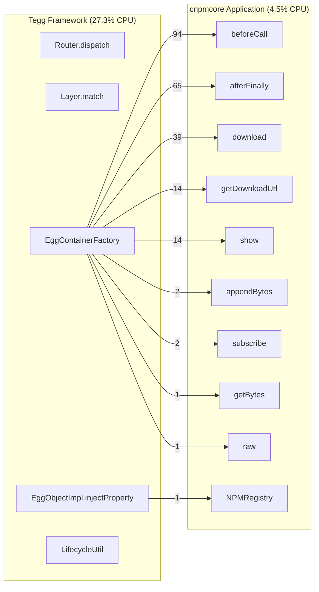
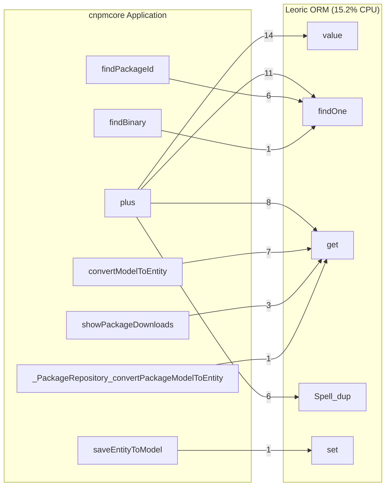

# Application ↔ Framework Call Relationship Analysis

## Overview

This report analyzes the call relationships between:
- **cnpmcore** (application code)
- **Leoric** (ORM layer)
- **Egg/Tegg** (framework layer)

## CPU Time Distribution by Layer

Based on active CPU analysis (excluding idle time):

| Layer | CPU Samples | % of Active CPU |
|-------|-------------|-----------------|
| Egg/Tegg Framework | 9,231 | 27.30% |
| Leoric ORM | 5,139 | 15.20% |
| cnpmcore Application | 1,511 | 4.47% |

## Call Relationship Diagrams

### 1. Tegg Framework → cnpmcore Application

The framework calls into application code primarily through:
- Controller method invocation
- Service/Repository instantiation
- Middleware chain execution



### 2. cnpmcore Application → Leoric ORM

Application code calls ORM for database operations:



## Detailed Relationship Tables

### Tegg Framework → cnpmcore Application

| Framework Function | App Function | CPU Samples | Notes |
|--------------------|--------------|-------------|-------|
| `beforeCall` | `beforeCall` | 94 | |
| `afterFinally` | `afterFinally` | 65 | |
| `(anonymous)` | `download` | 39 | |
| `lastCall` | `getDownloadUrl` | 14 | |
| `(anonymous)` | `show` | 14 | |
| `lastCall` | `appendBytes` | 2 | |
| `(anonymous)` | `subscribe` | 2 | |
| `lastCall` | `getBytes` | 1 | |
| `constructEggObject` | `NPMRegistry` | 1 | |
| `(anonymous)` | `raw` | 1 | |


### cnpmcore Application → Leoric ORM

| App Function | ORM Function | CPU Samples | Notes |
|--------------|--------------|-------------|-------|
| `plus` | `value` | 14 | |
| `plus` | `findOne` | 11 | |
| `plus` | `get` | 8 | |
| `convertModelToEntity` | `get` | 7 | |
| `findPackageId` | `findOne` | 6 | |
| `plus` | `Spell_dup` | 6 | |
| `showPackageDownloads` | `get` | 3 | |
| `findBinary` | `findOne` | 1 | |
| `saveEntityToModel` | `set` | 1 | |
| `_PackageRepository_convertPackageModelToEntity` | `get` | 1 | |


### cnpmcore Application → Tegg Framework

(When app code calls back into framework)

| App Function | Framework Function | CPU Samples | Notes |
|--------------|-------------------|-------------|-------|
| `Tracing` | `get` | 26 | |
| `afterFinally` | `get` | 25 | |
| `beforeCall` | `set` | 23 | |
| `download` | `execute` | 21 | |
| `download` | `get` | 10 | |
| `afterFinally` | `get` | 9 | |
| `savePackageVersionCounters` | `get` | 9 | |
| `download` | `redirect` | 2 | |
| `showPackageVersionByVersionOrTag` | `get` | 2 | |
| `getBugVersion` | `get` | 2 | |


## Complete Request Flow

```
┌─────────────────────────────────────────────────────────────────────────────┐
│                          HTTP Request                                       │
└─────────────────────────────────────────────────────────────────────────────┘
                                    │
                                    ▼
┌─────────────────────────────────────────────────────────────────────────────┐
│                    EGG/TEGG FRAMEWORK (27.3% CPU)                           │
├─────────────────────────────────────────────────────────────────────────────┤
│  1. ctxLifecycleMiddleware     - Request context setup                      │
│  2. Router.dispatch            - Route matching (Layer.match)               │
│  3. HTTPMethodRegister         - HTTP method handling                       │
│  4. EggContainerFactory        - Dependency injection container             │
│  5. EggObjectImpl.injectProperty - Property injection                       │
│  6. LifecycleUtil.getLifecycleHook - Lifecycle management                  │
│  7. ContextInitiator.init      - Context initialization                    │
└─────────────────────────────────────────────────────────────────────────────┘
                                    │
                                    ▼
┌─────────────────────────────────────────────────────────────────────────────┐
│                    CNPMCORE APPLICATION (4.5% CPU)                          │
├─────────────────────────────────────────────────────────────────────────────┤
│  Controllers:                                                               │
│    - DownloadPackageVersionTar.download                                     │
│    - DownloadController.showPackageDownloads                                │
│                                                                             │
│  Services:                                                                  │
│    - PackageManagerService.savePackageVersionCounters                       │
│    - PackageManagerService.plusPackageVersionCounter                        │
│                                                                             │
│  Repositories:                                                              │
│    - PackageRepository.findPackageId                                        │
│    - PackageVersionDownloadRepository.plus                                  │
│    - BinaryRepository.findBinary                                            │
└─────────────────────────────────────────────────────────────────────────────┘
                                    │
                                    ▼
┌─────────────────────────────────────────────────────────────────────────────┐
│                       LEORIC ORM (15.2% CPU)                                │
├─────────────────────────────────────────────────────────────────────────────┤
│  Query Methods:                                                             │
│    - Model.findOne()           - Single record lookup                       │
│    - Model.find()              - Multiple records                           │
│    - Model.value()             - Single value                               │
│                                                                             │
│  Query Building:                                                            │
│    - Spell (query builder)     - SQL generation                             │
│    - expr.token()              - Expression parsing                         │
│    - query_object.isLogicalCondition                                        │
│                                                                             │
│  Result Processing:                                                         │
│    - Collection.dispatch()     - Result iteration                           │
│    - ★ Bone constructor ★      - Model instantiation (1,574 samples)       │
│    - Bone.instantiate()        - Row to model conversion                    │
└─────────────────────────────────────────────────────────────────────────────┘
                                    │
                                    ▼
┌─────────────────────────────────────────────────────────────────────────────┐
│                       MYSQL2 DRIVER (6.5% CPU)                              │
├─────────────────────────────────────────────────────────────────────────────┤
│  - query.start()               - Query execution                            │
│  - column_definition.get()     - Column metadata                            │
│  - parser_cache.keyFromFields  - Parser caching                             │
│  - packet.parseDateTime()      - Date parsing                               │
└─────────────────────────────────────────────────────────────────────────────┘
```

## Key Findings

### 1. Framework Overhead (27.3% of active CPU)

The Tegg framework consumes the most CPU time due to:
- **Route matching**: `Layer.match()` is called for every route on every request
- **Dependency injection**: `injectProperty()` and `getOrCreateEggObject()` for per-request DI
- **Lifecycle management**: Context creation and lifecycle hooks

### 2. ORM Overhead (15.2% of active CPU)

Leoric ORM overhead comes from:
- **Bone constructor**: Creating model instances for each database row
- **Query building**: Spell and expression parsing
- **Result processing**: Collection dispatch and instantiation

### 3. Application Code Efficiency (4.5% of active CPU)

cnpmcore application code is very efficient:
- Most CPU time is in counter updates (`plusPackageVersionCounter`)
- Package lookups are well-optimized
- The overhead is in infrastructure, not business logic

## Optimization Recommendations

### For Framework Overhead
1. Consider route caching or pre-compiled route matching
2. Use singleton scope for stateless services
3. Lazy-load dependencies that aren't always needed

### For ORM Overhead
1. Use `.raw()` for read-only queries
2. Batch database operations
3. Cache frequently accessed data
4. Consider using raw SQL for high-frequency paths

### For Application Code
1. Current code is already efficient
2. Focus on reducing I/O and framework calls
3. Consider async batching for counter updates
