# Call Relationship: cnpmcore → Leoric ORM

## Overview

This report shows how cnpmcore application code calls into Leoric ORM and which paths consume the most CPU time.

## Call Graph (Mermaid)

```mermaid
flowchart LR
    subgraph cnpmcore["cnpmcore Application"]
        app_plus_PackageVersionDownloadRepository_13["plus"]
        app_findPackageId_PackageRepository_41["findPackageId"]
        app_convertModelToEntity_ModelConvertor_74["convertModelToEntity"]
        app_showPackageDownloads_DownloadController_20["showPackageDownloads"]
        app_saveEntityToModel_ModelConvertor_50["saveEntityToModel"]
        app_findBinary_BinaryRepository_27["findBinary"]
        app_query_ChangeRepository_17["query"]
        app__PackageRepository_convertPackageModelToEntity_PackageRepository_310["_PackageRepository_convertPackageModelToEntity"]
        app_findVersionByTag_PackageVersionRepository_33["findVersionByTag"]
        app_convertEntityToModel_ModelConvertor_8["convertEntityToModel"]
        app_findTask_TaskRepository_84["findTask"]
        app_fillPackageVersionEntityData_PackageRepository_259["fillPackageVersionEntityData"]
        app_saveTask_TaskRepository_18["saveTask"]
        app_findPackage_PackageRepository_29["findPackage"]
        app_findPackageVersionBlock_PackageVersionBlockRepository_30["findPackageVersionBlock"]
        app_findPackageVersion_PackageRepository_172["findPackageVersion"]
        app_saveTaskToHistory_TaskRepository_57["saveTaskToHistory"]
        app_listBinaries_BinaryRepository_33["listBinaries"]
        app_query_PackageVersionDownloadRepository_36["query"]
        app_findRegistryByRegistryId_RegistryRepository_32["findRegistryByRegistryId"]
    end

    subgraph leoric["Leoric ORM"]
        orm_findOne_bone_1377["findOne<br/>(11 hits)"]
        orm_Spell_dup_spell_963["Spell_dup<br/>(6 hits)"]
        orm_value_bone_1719["value<br/>(14 hits)"]
        orm_get_bone_1167["get<br/>(8 hits)"]
        orm_create_bone_1404["create<br/>(0 hits)"]
        orm_Spell_dup_spell_963["Spell_dup<br/>(1 hits)"]
        orm_findOne_bone_1377["findOne<br/>(6 hits)"]
        orm_get_bone_1167["get<br/>(1 hits)"]
        orm_get_bone_1167["get<br/>(2 hits)"]
        orm_get_bone_1167["get<br/>(3 hits)"]
        orm_save_bone_546["save<br/>(0 hits)"]
        orm_set_bone_1170["set<br/>(1 hits)"]
        orm_findOne_bone_1377["findOne<br/>(1 hits)"]
        orm_find_bone_1331["find<br/>(0 hits)"]
        orm_Spell_dup_spell_963["Spell_dup<br/>(0 hits)"]
        orm_toObject_collection_34["toObject<br/>(1 hits)"]
        orm_findOne_bone_1377["findOne<br/>(0 hits)"]
        orm_get_bone_1167["get<br/>(1 hits)"]
        orm_Spell_dup_spell_963["Spell_dup<br/>(1 hits)"]
        orm_create_bone_1404["create<br/>(0 hits)"]
        orm_findOne_bone_1377["findOne<br/>(1 hits)"]
        orm_findOne_bone_1377["findOne<br/>(1 hits)"]
        orm_findOne_bone_1377["findOne<br/>(1 hits)"]
        orm_findOne_bone_1377["findOne<br/>(0 hits)"]
        orm_findOne_bone_1377["findOne<br/>(0 hits)"]
        orm_findOne_bone_1377["findOne<br/>(0 hits)"]
        orm_findOne_bone_1377["findOne<br/>(0 hits)"]
        orm_find_bone_1331["find<br/>(0 hits)"]
        orm_find_bone_1331["find<br/>(0 hits)"]
        orm_findOne_bone_1377["findOne<br/>(0 hits)"]
    end

    app_plus_PackageVersionDownloadRepository_13 -->|"11"| orm_findOne_bone_1377
    app_plus_PackageVersionDownloadRepository_13 -->|"6"| orm_Spell_dup_spell_963
    app_plus_PackageVersionDownloadRepository_13 -->|"14"| orm_value_bone_1719
    app_plus_PackageVersionDownloadRepository_13 -->|"8"| orm_get_bone_1167
    app_plus_PackageVersionDownloadRepository_13 --> orm_create_bone_1404
    app_findPackageId_PackageRepository_41 -->|"1"| orm_Spell_dup_spell_963
    app_findPackageId_PackageRepository_41 -->|"6"| orm_findOne_bone_1377
    app_findPackageId_PackageRepository_41 -->|"1"| orm_get_bone_1167
    app_convertModelToEntity_ModelConvertor_74 -->|"2"| orm_get_bone_1167
    app_showPackageDownloads_DownloadController_20 -->|"3"| orm_get_bone_1167
    app_saveEntityToModel_ModelConvertor_50 --> orm_save_bone_546
    app_saveEntityToModel_ModelConvertor_50 -->|"1"| orm_set_bone_1170
    app_findBinary_BinaryRepository_27 -->|"1"| orm_findOne_bone_1377
    app_query_ChangeRepository_17 --> orm_find_bone_1331
    app_query_ChangeRepository_17 --> orm_Spell_dup_spell_963
    app_query_ChangeRepository_17 -->|"1"| orm_toObject_collection_34
    app__PackageRepository_convertPackageModelToEntity_PackageRepository_310 --> orm_findOne_bone_1377
    app__PackageRepository_convertPackageModelToEntity_PackageRepository_310 -->|"1"| orm_get_bone_1167
    app_findVersionByTag_PackageVersionRepository_33 -->|"1"| orm_Spell_dup_spell_963
    app_convertEntityToModel_ModelConvertor_8 --> orm_create_bone_1404
    app_findTask_TaskRepository_84 -->|"1"| orm_findOne_bone_1377
    app_fillPackageVersionEntityData_PackageRepository_259 -->|"1"| orm_findOne_bone_1377
    app_saveTask_TaskRepository_18 -->|"1"| orm_findOne_bone_1377
    app_findPackage_PackageRepository_29 --> orm_findOne_bone_1377
    app_findPackageVersionBlock_PackageVersionBlockRepository_30 --> orm_findOne_bone_1377
    app_findPackageVersion_PackageRepository_172 --> orm_findOne_bone_1377
    app_saveTaskToHistory_TaskRepository_57 --> orm_findOne_bone_1377
    app_listBinaries_BinaryRepository_33 --> orm_find_bone_1331
    app_query_PackageVersionDownloadRepository_36 --> orm_find_bone_1331
    app_findRegistryByRegistryId_RegistryRepository_32 --> orm_findOne_bone_1377

```



## Top cnpmcore → Leoric Call Paths by CPU Impact

| cnpmcore Function | Leoric Function | CPU Samples |
|-------------------|-----------------|-------------|
| `plus` | `value` | 14 |
| `plus` | `findOne` | 11 |
| `plus` | `get` | 8 |
| `plus` | `Spell_dup` | 6 |
| `findPackageId` | `findOne` | 6 |
| `findPackageId` | `Spell_dup` | 1 |
| `findPackageId` | `get` | 1 |
| `convertModelToEntity` | `get` | 2 |
| `showPackageDownloads` | `get` | 3 |
| `saveEntityToModel` | `set` | 1 |
| `findBinary` | `findOne` | 1 |
| `query` | `toObject` | 1 |
| `_PackageRepository_convertPackageModelToEntity` | `get` | 1 |
| `findVersionByTag` | `Spell_dup` | 1 |
| `findTask` | `findOne` | 1 |
| `fillPackageVersionEntityData` | `findOne` | 1 |
| `saveTask` | `findOne` | 1 |


## Most CPU-Intensive Leoric Functions

| Leoric Function | Total CPU Samples | Called From |
|-----------------|-------------------|-------------|
| `findOne` | 21 | `plus`, `findPackageId`, `findBinary` |
| `get` | 15 | `plus`, `showPackageDownloads`, `convertModelToEntity` |
| `value` | 14 | `plus` |
| `Spell_dup` | 8 | `plus`, `findVersionByTag`, `findPackageId` |
| `set` | 1 | `saveEntityToModel` |
| `toObject` | 1 | `query` |


## Detailed Call Chains

These are the complete call chains from cnpmcore code to Leoric hotspots:

### Chain 1 (164 CPU samples)

```
[APP] savePackageVersionCounters@PackageManagerService:435
[APP] plus@PackageVersionDownloadRepository:13
[ORM] findOne@bone:1377
[ORM] _find@bone:1341
[ORM] $where@spell:589
[ORM] parseConditions@spell:45
[ORM] parseObject@query_object:178
[ORM] isLogicalCondition@query_object:102
```

### Chain 2 (77 CPU samples)

```
[APP] savePackageVersionCounters@PackageManagerService:435
[APP] findPackageId@PackageRepository:41
[ORM] findOne@bone:1377
[ORM] _find@bone:1341
[ORM] $where@spell:589
[ORM] parseConditions@spell:45
[ORM] parseObject@query_object:178
[ORM] isLogicalCondition@query_object:102
```

### Chain 3 (72 CPU samples)

```
[APP] plus@PackageVersionDownloadRepository:13
[ORM] value@bone:1719
[ORM] _find@bone:1341
[ORM] Spell@spell:325
[ORM] parseExpr@expr:442
[ORM] parseExprList@expr:137
[ORM] expr@expr:368
[ORM] token@expr:266
```

### Chain 4 (68 CPU samples)

```
[APP] savePackageVersionCounters@PackageManagerService:435
[APP] plus@PackageVersionDownloadRepository:13
[ORM] findOne@bone:1377
[ORM] _find@bone:1341
[ORM] Spell@spell:325
[ORM] parseExpr@expr:442
[ORM] parseExprList@expr:137
[ORM] expr@expr:368
[ORM] token@expr:266
```

### Chain 5 (52 CPU samples)

```
[APP] plus@PackageVersionDownloadRepository:13
[ORM] Spell_dup@spell:963
[ORM] $increment@spell:531
```

### Chain 6 (51 CPU samples)

```
[APP] savePackageVersionCounters@PackageManagerService:435
[APP] plus@PackageVersionDownloadRepository:13
[ORM] findOne@bone:1377
[ORM] _find@bone:1341
[ORM] $where@spell:589
[ORM] parseConditions@spell:45
[ORM] parseObject@query_object:178
[ORM] parseExpr@expr:442
[ORM] parseExprList@expr:137
[ORM] expr@expr:368
[ORM] token@expr:266
```

### Chain 7 (49 CPU samples)

```
[APP] plus@PackageVersionDownloadRepository:13
[ORM] Spell_dup@spell:963
[ORM] get dup@spell:402
[ORM] Spell@spell:325
```

### Chain 8 (42 CPU samples)

```
[APP] savePackageVersionCounters@PackageManagerService:435
[APP] plus@PackageVersionDownloadRepository:13
[ORM] findOne@bone:1377
[ORM] _find@bone:1341
[ORM] Spell@spell:325
```

### Chain 9 (30 CPU samples)

```
[APP] savePackageVersionCounters@PackageManagerService:435
[APP] plus@PackageVersionDownloadRepository:13
[ORM] findOne@bone:1377
[ORM] _find@bone:1341
[ORM] $where@spell:589
[ORM] parseConditions@spell:45
[ORM] parseObject@query_object:178
[ORM] parseExpr@expr:442
[ORM] parseExprList@expr:137
[ORM] expr@expr:368
```

### Chain 10 (29 CPU samples)

```
[APP] savePackageVersionCounters@PackageManagerService:435
[APP] findPackageId@PackageRepository:41
[ORM] Spell_dup@spell:963
[ORM] $select@spell:517
[ORM] parseSelect@spell:61
[ORM] (anonymous)@spell:67
```


## Summary

The main entry points from cnpmcore to Leoric are:

1. **`plus`** - 39 CPU samples
2. **`findPackageId`** - 8 CPU samples
3. **`convertModelToEntity`** - 7 CPU samples
4. **`showPackageDownloads`** - 3 CPU samples
5. **`saveEntityToModel`** - 1 CPU samples
