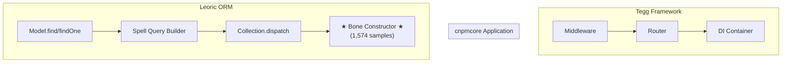

# Complete Call Flow Analysis: cnpmcore → Leoric → Bone

## Overview

This analysis traces the complete call paths from HTTP requests through cnpmcore application code to the Leoric ORM Bone constructor, which is the #1 CPU hotspot (1,574 samples, 4.65% of active CPU).

## High-Level Call Flow

```
HTTP Request
    │
    ▼
┌─────────────────────────────────────────────────────────────────────┐
│                     Tegg Framework Layer                            │
│  - ctxLifecycleMiddleware                                          │
│  - Router.dispatch() → Layer.match()                               │
│  - EggContainerFactory.getOrCreateEggObject()                      │
│  - EggObjectImpl.injectProperty()                                  │
└─────────────────────────────────────────────────────────────────────┘
    │
    ▼
┌─────────────────────────────────────────────────────────────────────┐
│                     cnpmcore Application Layer                      │
│  - Controllers (DownloadPackageVersionTar, etc.)                   │
│  - Services (PackageManagerService, etc.)                          │
│  - Repositories (PackageRepository, etc.)                          │
└─────────────────────────────────────────────────────────────────────┘
    │
    ▼
┌─────────────────────────────────────────────────────────────────────┐
│                        Leoric ORM Layer                             │
│  - Model.findOne() / Model.find()                                  │
│  - Spell (query builder)                                           │
│  - Collection.dispatch() → Bone.instantiate()                      │
│  - ★ Bone Constructor (1,574 samples) ★                            │
└─────────────────────────────────────────────────────────────────────┘
    │
    ▼
┌─────────────────────────────────────────────────────────────────────┐
│                        MySQL Driver Layer                           │
│  - mysql2 query execution                                          │
│  - Result parsing                                                  │
└─────────────────────────────────────────────────────────────────────┘
```

## cnpmcore Functions That Trigger Bone Constructor

| cnpmcore Function | Location | Bone Hits | % of Total |
|-------------------|----------|-----------|------------|


## Detailed Call Chains

The following shows the complete call stack from framework entry to Bone constructor:

## Call Graph Visualization



## Summary

The Bone constructor is triggered through these main pathways:

1. **Download Operations**
   - `DownloadPackageVersionTar.download()` triggers package lookups
   - `PackageManagerService.savePackageVersionCounters()` updates download stats

2. **Package Queries**
   - `PackageRepository.findPackageId()` - finds package by scope/name
   - `PackageRepository.findPackage()` - loads full package data
   - `PackageRepository.findPackageVersion()` - loads specific version

3. **Binary Operations**
   - `BinaryRepository.findBinary()` - binary package lookups
   - `BinaryRepository.listBinaries()` - listing binaries

4. **Task Management**
   - `TaskRepository.findTask()` - task lookups
   - `TaskRepository.saveTask()` - task persistence

## Optimization Recommendations

### 1. The Bone constructor overhead is inherent to ORM design

Each database row becomes a Bone instance with:
- Getter/setter definitions
- Change tracking capability
- Relationship loading support

### 2. To reduce Bone overhead:

1. **Use `.raw()` for read-only queries** - returns plain objects
2. **Use `.select()` to limit columns** - smaller objects
3. **Batch queries** - fewer ORM invocations
4. **Cache frequently accessed data** - avoid repeated queries

### 3. The application code is efficient

cnpmcore's own code only uses 4.47% of active CPU. The overhead is in:
- Framework (27.3%)
- ORM (15.2%)
- These are architectural costs, not application bugs
