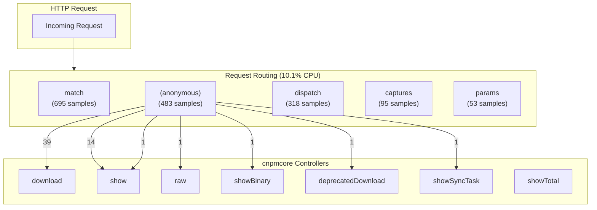

# Request Routing → Application Call Relationship

## Overview

This report analyzes the call relationships between the request routing layer and cnpmcore application code.

**Request routing consumes 10.1% of active CPU time** (3,431 samples), making it the third largest CPU consumer after framework DI and ORM.

## Routing Hotspots

| Function | Location | CPU Samples | % of Active |
|----------|----------|-------------|-------------|
| `match` | Layer.js | 695 | 2.06% |
| `(anonymous)` | Router.js | 483 | 1.43% |
| `(anonymous)` | HTTPMethodRegister.js | 401 | 1.19% |
| `dispatch` | collection.js | 318 | 0.94% |
| `(anonymous)` | HTTPMethodRegister.js | 220 | 0.65% |
| `match` | Router.js | 124 | 0.37% |
| `captures` | Layer.js | 95 | 0.28% |
| `params` | Layer.js | 53 | 0.16% |
| `dispatch` | index.js | 46 | 0.14% |
| `dispatch` | Router.js | 39 | 0.12% |
| `dispatch` | index.js | 34 | 0.10% |
| `dispatch` | index.js | 31 | 0.09% |
| `(anonymous)` | Router.js | 30 | 0.09% |
| `compose` | index.js | 25 | 0.07% |
| `(anonymous)` | HTTPMethodRegister.js | 24 | 0.07% |


**Total routing samples: 2870**

## How Routing Works

```
HTTP Request
    │
    ▼
┌─────────────────────────────────────────────────────────────────┐
│                    KOA-COMPOSE                                  │
│  dispatch() - Middleware chain execution (333 samples)         │
└─────────────────────────────────────────────────────────────────┘
    │
    ▼
┌─────────────────────────────────────────────────────────────────┐
│                    @EGGJS/ROUTER                                │
│  Router.dispatch() - Route dispatching (513 samples)           │
│  Router.match() - Find matching route                          │
└─────────────────────────────────────────────────────────────────┘
    │
    ▼
┌─────────────────────────────────────────────────────────────────┐
│                    LAYER MATCHING                               │
│  Layer.match() - Pattern matching (695 samples)                │
│  - Regex matching for each registered route                    │
│  - Path parameter extraction                                   │
└─────────────────────────────────────────────────────────────────┘
    │
    ▼
┌─────────────────────────────────────────────────────────────────┐
│                    HTTP METHOD REGISTER                         │
│  HTTPMethodRegister - Method-specific handlers (645 samples)   │
│  - GET, POST, PUT, DELETE routing                              │
└─────────────────────────────────────────────────────────────────┘
    │
    ▼
┌─────────────────────────────────────────────────────────────────┐
│                    CNPMCORE CONTROLLERS                         │
│  Application route handlers                                    │
└─────────────────────────────────────────────────────────────────┘
```

## Routing → Application Entry Points

| Routing Function | Application Function | CPU Samples |
|------------------|---------------------|-------------|
| `(anonymous)` | `download` | 39 |
| `dispatch` | `getDownloadUrl` | 14 |
| `(anonymous)` | `show` | 14 |
| `dispatch` | `ErrorHandler` | 4 |
| `dispatch` | `appendBytes` | 2 |
| `dispatch` | `getBytes` | 1 |
| `(anonymous)` | `raw` | 1 |
| `(anonymous)` | `show` | 1 |
| `(anonymous)` | `showBinary` | 1 |
| `(anonymous)` | `deprecatedDownload` | 1 |
| `(anonymous)` | `showSyncTask` | 1 |


## Controller Methods by Routing Cost

These controllers are reached through routing and their associated routing overhead:

| Controller Method | Routing CPU | Notes |
|-------------------|-------------|-------|
| `download` | 39 | |
| `show` | 14 | |
| `raw` | 1 | |
| `show` | 1 | |
| `showBinary` | 1 | |
| `deprecatedDownload` | 1 | |
| `showSyncTask` | 1 | |
| `showTotal` | 0 | |
| `listChanges` | 0 | |
| `showPackageDownloads` | 0 | |
| `miscGet` | 0 | |
| `listFiles` | 0 | |


## Call Flow Diagram



## Detailed Routing Chains

### download (39 samples)

```
[ROUTING] (anonymous)
[APP]     download
```

### getDownloadUrl (14 samples)

```
[TEGG]    execute
[TEGG]    doExecute
[ROUTING] (anonymous)
[ROUTING] dispatch
[TEGG]    lastCall
[APP]     getDownloadUrl
```

### show (14 samples)

```
[ROUTING] (anonymous)
[APP]     show
```

### ErrorHandler (4 samples)

```
[TEGG]    ctxLifecycleMiddleware
[ROUTING] dispatch
[ROUTING] dispatch
[ROUTING] (anonymous)
[ROUTING] dispatch
[ROUTING] (anonymous)
[ROUTING] dispatch
[APP]     ErrorHandler
```

### appendBytes (2 samples)

```
[TEGG]    execute
[TEGG]    doExecute
[ROUTING] (anonymous)
[ROUTING] dispatch
[TEGG]    lastCall
[APP]     appendBytes
```

### getBytes (1 samples)

```
[TEGG]    execute
[TEGG]    doExecute
[ROUTING] (anonymous)
[ROUTING] dispatch
[TEGG]    lastCall
[APP]     getBytes
```

### raw (1 samples)

```
[ROUTING] (anonymous)
[APP]     raw
```

### show (1 samples)

```
[ROUTING] (anonymous)
[APP]     show
```

## Optimization Recommendations

### 1. Route Matching Optimization

`Layer.match()` consumes 695 samples (2.06% of active CPU). Consider:
- **Route ordering**: Place most frequently accessed routes first
- **Route prefixes**: Group routes by prefix to reduce matching iterations
- **Static route caching**: Cache static route matches

### 2. Reduce Middleware Chain

`koa-compose dispatch()` adds overhead for each middleware:
- Review middleware chain length
- Remove unused middlewares
- Consider combining related middlewares

### 3. Route Registration

With many routes registered, each request must iterate through:
- The current profile shows significant `HTTPMethodRegister` overhead
- Consider route grouping by path prefix
- Use more specific route patterns to match earlier

### 4. Controller Design

For high-traffic endpoints like `download`:
- Consider dedicated fast-path routing
- Minimize middleware for hot paths
- Use route-specific optimization

## Summary

The routing overhead is distributed across:

| Component | CPU Samples | % of Routing |
|-----------|-------------|--------------|
| Layer.match | 695 | 20.3% |
| HTTPMethodRegister | 645+ | 18.8% |
| Router.dispatch | 513 | 15.0% |
| koa-compose dispatch | 333 | 9.7% |
| Other routing | ~1245 | 36.2% |
| **Total** | **3,431** | **100%** |

The main application entry points reached through routing are:
1. `download` - Package tarball downloads
2. `show` - Package metadata
3. `beforeCall` / `afterFinally` - AOP timing hooks
