# CPU Profile Analysis Report - cnpmcore v4.16.0

**Profile File:** `x-cpuprofile-3642061-20251213-0.cpuprofile`
**Generated by:** xprofiler
**Analysis Date:** 2025-12-13

## Executive Summary

The CPU profile shows the application is **mostly idle (96.5%)**, indicating the server is not under heavy CPU load. During active processing, the main CPU consumers are:

1. **Garbage Collection (0.34%)** - Normal for Node.js applications
2. **ORM Layer (leoric) (0.33%)** - Database object instantiation and query building
3. **MySQL Driver (mysql2) (0.15%)** - Database communication
4. **HTTP/Network (undici) (0.08%)** - HTTP client operations
5. **Tegg Runtime (0.08%)** - Dependency injection framework

## Time Distribution

| Category | Samples | Percentage |
|----------|---------|------------|
| Idle | 163,092 | 96.50% |
| Active | 5,915 | 3.50% |
| GC | 573 | 0.34% |
| Program | 693 | 0.41% |

**Total Samples:** 169,007
**Total Nodes:** 3,011

## Top CPU Consumers (Active Time Only)

### By Module/Package

| Rank | Module | Self Time % | Key Functions |
|------|--------|-------------|---------------|
| 1 | leoric (ORM) | 0.33% | Bone constructor, dispatch, instantiate |
| 2 | mysql2 | 0.15% | column_definition.get, query.start, parseDateTime |
| 3 | undici (HTTP) | 0.08% | execute, _resume, onHttpSocketReadable |
| 4 | @eggjs/tegg-runtime | 0.08% | injectProperty, getOrCreateEggObject |
| 5 | node:streams/readable | 0.06% | Readable.read, fromList |
| 6 | node:stream_base_commons | 0.06% | onStreamRead, writevGeneric |
| 7 | node:net | 0.06% | Socket operations |
| 8 | urllib | 0.05% | requestInternal, parseJSON |
| 9 | @eggjs/router | 0.04% | match, dispatch |
| 10 | @eggjs/koa | 0.04% | _respond, set headers |

### Top Functions by Self Time

| Rank | Function | Location | Samples | % |
|------|----------|----------|---------|---|
| 1 | Bone (constructor) | leoric/lib/bone.js:151 | 94 | 0.06% |
| 2 | dispatch | leoric/lib/collection.js:81 | 44 | 0.03% |
| 3 | _addHeaderLine | node:_http_incoming:382 | 40 | 0.02% |
| 4 | get (column def) | mysql2/lib/packets/column_definition.js:263 | 38 | 0.02% |
| 5 | objEquiv | deep-equal/index.js:276 | 70 | 0.04% |
| 6 | start (query) | mysql2/lib/commands/query.js:48 | 38 | 0.02% |
| 7 | _respond | @eggjs/koa/application.js:218 | 34 | 0.02% |
| 8 | tryStringObject | is-string/index.js:9 | 30 | 0.02% |
| 9 | Router.match | @eggjs/router/Router.js:137 | 30 | 0.02% |
| 10 | instantiate | leoric/lib/bone.js:1283 | 26 | 0.02% |

## cnpmcore Application Code Analysis

### Controllers (Total: ~52 samples, 0.03%)

| Function | File | Samples |
|----------|------|---------|
| formatItems | BinarySyncController.js:134 | 6 |
| showBinary | BinarySyncController.js:38 | 3 |
| getAllowSync | AbstractController.js:59 | 1 |
| deprecatedShowSyncTask | PackageSyncController.js:155 | 1 |
| showSyncTask | PackageSyncController.js:102 | 1 |

### Services (Total: ~28 samples, 0.02%)

| Function | File | Samples |
|----------|------|---------|
| syncDir | BinarySyncerService.js:137 | 12 |
| isoNow | BinarySyncerService.js:23 | 4 |
| diff | BinarySyncerService.js:228 | 3 |
| appendTaskLog | TaskService.js:140 | 2 |
| syncPackageWithPackument | PackageSyncerService.js:939 | 3 |

### Repositories (Total: ~58 samples, 0.03%)

| Function | File | Samples |
|----------|------|---------|
| convertModelToEntity | ModelConvertor.js:74 | 32 |
| listBinaries | BinaryRepository.js:33 | 9 |
| saveTask | TaskRepository.js:18 | 6 |
| saveEntityToModel | ModelConvertor.js:50 | 2 |
| findBinary | BinaryRepository.js:27 | 2 |

## Key Findings

### 1. ORM Overhead (leoric)
The ORM layer `leoric` consumes the most CPU time among dependencies:
- **Bone constructor** (96 samples): Entity instantiation overhead
- **dispatch** (44 samples): Query result processing
- **instantiate** (28 samples): Model instantiation
- **isLogicalCondition** (45 samples): Query condition parsing

**Recommendation:** Consider caching frequently accessed entities or using raw queries for hot paths.

### 2. Deep-Equal Comparisons
The `deep-equal` package consumes notable CPU (70 samples in `objEquiv`), along with helper packages like `is-string`, `is-map`, `is-weakset`.

**Recommendation:** Review where deep equality checks are used; consider simpler comparison methods where possible.

### 3. Model-Entity Conversion
`convertModelToEntity` in `ModelConvertor.js:74` is called frequently (32 samples total).

**Recommendation:** This is expected for ORM operations, but could be optimized by:
- Lazy loading of entity properties
- Caching entity instances where appropriate

### 4. Binary Sync Operations
`BinarySyncerService.syncDir` appears as the hottest application service function (12 samples).

**Recommendation:** This is likely the main workload during the profiling period. Normal behavior for binary sync operations.

### 5. Network I/O
HTTP client (urllib/undici) and MySQL driver are performing as expected with no unusual overhead.

## Performance Recommendations

### High Priority
1. **Investigate `deep-equal` usage** - The library and its dependencies (`is-string`, `is-map`, etc.) consume measurable CPU. Consider if all deep equality checks are necessary.

### Medium Priority
2. **ORM optimization** - The `leoric` ORM consumes the most CPU. For high-frequency queries:
   - Consider using `SELECT` with specific columns instead of full model hydration
   - Use raw SQL for bulk operations
   - Implement query result caching for frequently accessed data

3. **Entity conversion caching** - The `convertModelToEntity` function is called frequently. Consider caching strategies for read-heavy operations.

### Low Priority
4. **Router matching** - The router's `match` function appears in the profile but is not a major concern at current load levels.

## Conclusion

The application is performing well with 96.5% idle time, indicating plenty of headroom. The active CPU time is dominated by expected operations:

- Database ORM operations (leoric + mysql2)
- HTTP client operations (urllib + undici)
- Framework overhead (@eggjs/tegg, @eggjs/router)

No critical performance issues were identified. The main optimization opportunities are in reducing ORM overhead and reviewing deep-equal usage patterns.

## Call Relationship Diagrams

### ORM (leoric) Call Chain
```
processTicksAndRejections
  └─ runMicrotasks
      └─ ignite
          └─ init
              └─ dispatch (44 samples)
                  └─ instantiate (26 samples)
                      ├─ _setRaw (18 samples)
                      ├─ _setRawSaved (5 samples)
                      └─ cast (3 samples)
```

### MySQL Call Chain
```
(anonymous) [mysql2/connection.js]
  └─ handlePacket
      └─ execute
          ├─ start (38 samples)
          │   ├─ toPacket (5 samples)
          │   └─ writePacket (2 samples)
          └─ readField (8 samples)
              └─ getTextParser
                  └─ getParser
                      └─ keyFromFields (14 samples)
                          └─ get (38 samples)
```

### HTTP Client Call Chain
```
processTicksAndRejections
  └─ emitReadable_
      └─ emit
          └─ onHttpSocketReadable
              └─ readMore
                  └─ execute (28 samples)

processTicksAndRejections
  └─ runMicrotasks
      └─ #requestInternal
          └─ parseJSON (15 samples)
```

### Application Code Call Chain
```
processTicksAndRejections
  └─ runMicrotasks
      ├─ syncDir (12 samples) [BinarySyncerService]
      ├─ listBinaries (9 samples) [BinaryRepository]
      │   └─ convertModelToEntity (21 samples)
      └─ _downloadToTempfile (7 samples) [NFSAdapter]
```

### Visual Call Graph (Mermaid)

The file `call-graph.mmd` contains a Mermaid diagram that can be rendered in:
- GitHub (paste into .md file)
- VS Code (with Mermaid extension)
- https://mermaid.live/

```mermaid
flowchart TD
    subgraph ORM["ORM (leoric)"]
        init[init] --> dispatch[dispatch<br/>44 samples]
        dispatch --> instantiate[instantiate<br/>26 samples]
        instantiate --> _setRaw[_setRaw<br/>18 samples]
    end

    subgraph MySQL["MySQL Driver"]
        execute_mysql[execute] --> start[start<br/>38 samples]
        execute_mysql --> readField[readField]
        readField --> keyFromFields[keyFromFields<br/>14 samples]
        keyFromFields --> get_col[get<br/>38 samples]
    end

    subgraph App["Application"]
        syncDir[syncDir<br/>12 samples]
        listBinaries[listBinaries<br/>9 samples]
        convertModel[convertModelToEntity<br/>21 samples]
        listBinaries --> convertModel
    end

    subgraph HTTP["HTTP Client"]
        readMore[readMore] --> execute_http[execute<br/>28 samples]
        requestInternal[requestInternal] --> parseJSON[parseJSON<br/>15 samples]
    end

    style dispatch fill:#ff6b6b
    style instantiate fill:#ff6b6b
    style start fill:#ff6b6b
    style get_col fill:#ff6b6b
    style convertModel fill:#ff6b6b
```



## Files Generated

- `analyze-cpuprofile.cjs` - Basic analysis script
- `analyze-call-graph.cjs` - Call graph analysis script
- `analysis-report.json` - Full JSON report with detailed statistics
- `call-graph.mmd` - Mermaid diagram of call relationships
- `call-relationships.txt` - Text-based call relationship report
- `REPORT.md` - This report
