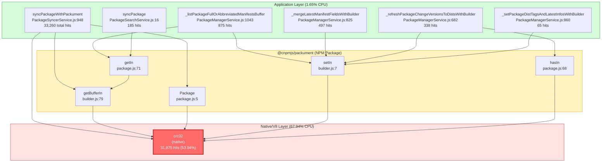
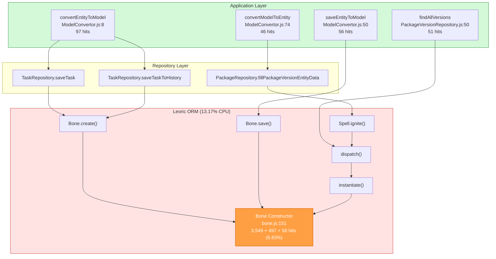

# Application Call Relationship Diagrams - v4.16.2

## Summary

This profile (version 4.16.2) shows a **significantly different hotspot pattern** compared to previous versions. The main CPU consumer is now the **crc32** function (53.94% of active CPU) from the `@cnpmjs/packument` package, which is used for data integrity checking during package synchronization.

## Key Hotspots Overview

| Rank | Function | % of Active | Source |
|------|----------|-------------|--------|
| 1 | crc32 | 53.94% | @cnpmjs/packument (native) |
| 2 | Bone constructor | 6.83% | leoric ORM |
| 3 | update (native) | 1.18% | V8/Native |
| 4 | writeSync (native) | 1.10% | V8/Native |
| 5 | _copyActual | 0.92% | node:buffer |

## Call Flow Diagram - CRC32 Hotspot



## Call Flow Diagram - Leoric Bone Hotspot



## Detailed Call Paths

### Path 1: syncPackageWithPackument → crc32 (Highest: 33,260 hits)

```
PackageSyncerService.executeTask()
    └── PackageSyncerService.syncPackageWithPackument()
        ├── @cnpmjs/packument.getBufferIn()
        │   └── crc32() [31,975 hits - MAIN HOTSPOT]
        ├── @cnpmjs/packument.Package()
        │   └── crc32() [264 hits]
        └── direct crc32 calls [561 + 403 hits]
```

**Analysis**: The `syncPackageWithPackument` method is the main entry point that triggers CRC32 calculations. The packument library uses CRC32 for data integrity verification when reading/writing package metadata.

### Path 2: _listPackageFullOrAbbreviatedManifestsBuffer → crc32 (875 hits)

```
PackageManagerService._listPackageFullOrAbbreviatedManifestsBuffer()
    ├── @cnpmjs/packument.setIn()
    │   └── crc32() [506 hits]
    └── @cnpmjs/packument.getIn()
        └── getBufferIn()
            └── crc32() [369 hits]
```

### Path 3: Entity Operations → Bone Constructor (97 hits)

```
TaskService.createTask()
    └── TaskRepository.saveTask()
        └── ModelConvertor.convertEntityToModel()
            └── Bone.create()
                └── ContextModelClass()
                    └── Bone() constructor [58 hits]
```

## Application Entry Points by Total Hits

| Rank | Entry Point | Total Hits | File |
|------|-------------|------------|------|
| 1 | syncPackageWithPackument | 33,260 | PackageSyncerService.js:948 |
| 2 | _listPackageFullOrAbbreviatedManifestsBuffer | 875 | PackageManagerService.js:1043 |
| 3 | _mergeLatestManifestFieldsWithBuilder | 497 | PackageManagerService.js:825 |
| 4 | _refreshPackageChangeVersionsToDistsWithBuilder | 338 | PackageManagerService.js:682 |
| 5 | syncPackage | 185 | PackageSearchService.js:16 |
| 6 | convertEntityToModel | 97 | ModelConvertor.js:8 |
| 7 | _setPackageDistTagsAndLatestInfosWithBuilder | 65 | PackageManagerService.js:860 |
| 8 | saveEntityToModel | 56 | ModelConvertor.js:50 |
| 9 | findAllVersions | 51 | PackageVersionRepository.js:50 |

## CRC32 Analysis

The `crc32` function is a native implementation used by `@cnpmjs/packument` for data integrity verification. It's being called during:

1. **Reading package data** (`getBufferIn`, `getIn`) - Verifies data integrity when reading from storage
2. **Writing package data** (`setIn`) - Calculates checksums when storing package metadata
3. **Package initialization** (`Package` constructor) - Initial data validation

### Why is CRC32 so expensive in this profile?

- The profile was captured during heavy package synchronization operations
- Each package sync involves multiple CRC32 calculations for:
  - Reading upstream package metadata
  - Writing to local storage
  - Verifying data integrity
- Large packages with many versions amplify this cost

## Files to Review for Optimization

1. **`app/core/service/PackageSyncerService.ts`** - Main sync logic, consider batch processing
2. **`app/core/service/PackageManagerService.ts`** - Package manifest handling
3. **`app/core/service/PackageSearchService.ts`** - Search/sync operations
4. **`@cnpmjs/packument`** - Consider if all CRC checks are necessary, or if caching can help
5. **`app/repository/util/ModelConvertor.ts`** - Entity/Model conversion
