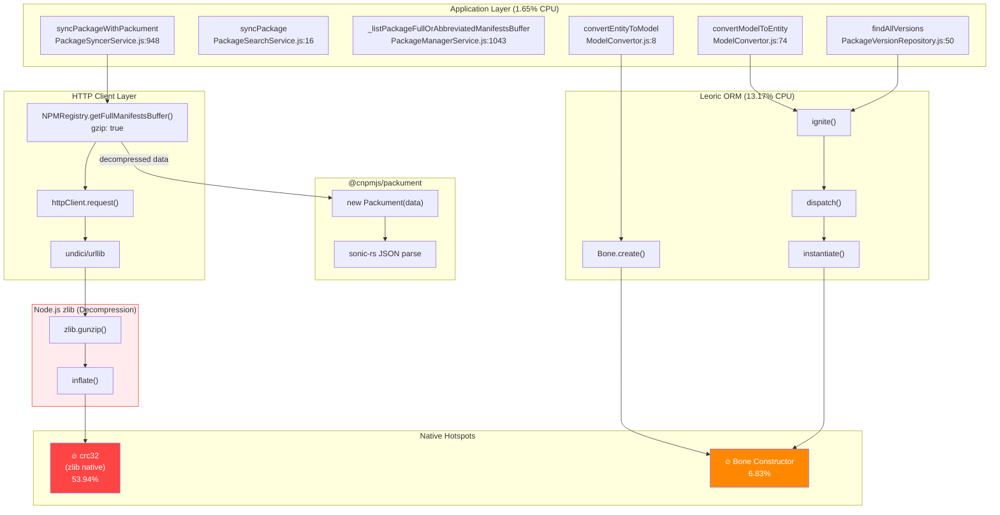
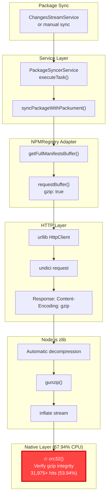
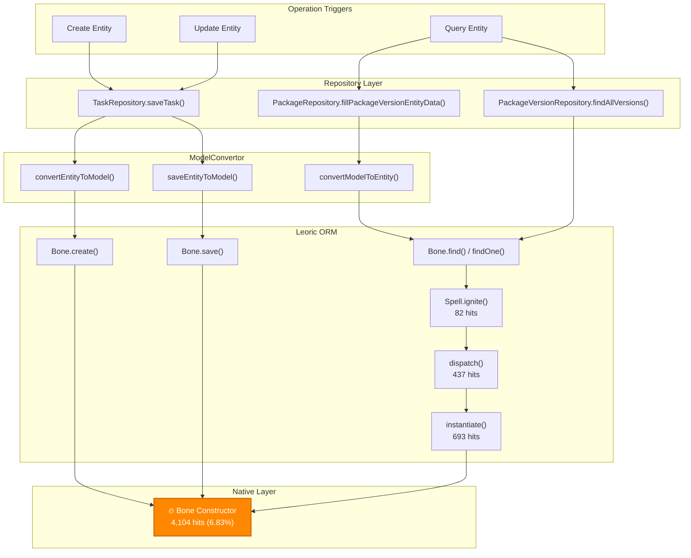

# Hotspot Call Relationship Diagram - v4.16.2

## Key Finding: CRC32 Source Identified

The **crc32 (53.94% of active CPU)** is NOT from `@cnpmjs/packument` as initially thought. It's from **Node.js zlib gzip decompression**.

### Root Cause Analysis

1. **NPMRegistry.ts:161** uses `gzip: true` for HTTP requests
2. Responses from registry.npmjs.org are gzip-compressed (often several MB for large packages)
3. Node.js zlib decompresses the data
4. **Gzip uses CRC32 internally for data integrity verification**

```
syncPackageWithPackument()
    └── getFullManifestsBuffer()
        └── httpClient.request({ gzip: true })
            └── urllib/undici receives gzip response
                └── Node.js zlib decompress
                    └── 🔥 crc32() [53.94% CPU]
```

## Complete Hotspot Relationship Overview



## Corrected Call Flow: CRC32 from Gzip Decompression



## Leoric Bone Call Chain (Unchanged)



## Summary: Hotspot Sources

| Hotspot | % CPU | Actual Source | Why |
|---------|-------|---------------|-----|
| **crc32** | 53.94% | **Node.js zlib** | Gzip decompression of HTTP responses from registry.npmjs.org |
| **Bone** | 6.83% | Leoric ORM | Database model instantiation |
| **_copyActual** | 1.75% | node:buffer | Buffer operations during data processing |
| **mysql2 ops** | 2.95% | MySQL driver | Database queries |

## Why CRC32 is So Expensive

1. **Large Packument Data**: Some packages (e.g., `@types/node`, `lodash`) have megabytes of metadata
2. **Gzip Compression**: Registry responses are gzip-compressed for network efficiency
3. **CRC32 for Integrity**: Gzip format includes CRC32 checksums that must be verified during decompression
4. **Native Implementation**: CRC32 is computed at native layer, shows as `(native)` in profiler

## Optimization Options

### For CRC32 (Gzip Decompression)

1. **Disable gzip for local/fast networks**: If network is fast, raw transfer might be cheaper than decompression
   ```typescript
   // In NPMRegistry.ts, conditionally disable gzip
   gzip: this.config.cnpmcore.disableGzipForSync ? false : true,
   ```

2. **Pre-cache large packuments**: Avoid repeated downloads and decompression

3. **Use streaming decompression**: Process data as it arrives instead of buffering

### For Bone Constructor (Leoric ORM)

1. Use raw queries for read-heavy operations
2. Batch operations where possible
3. Select only needed columns
