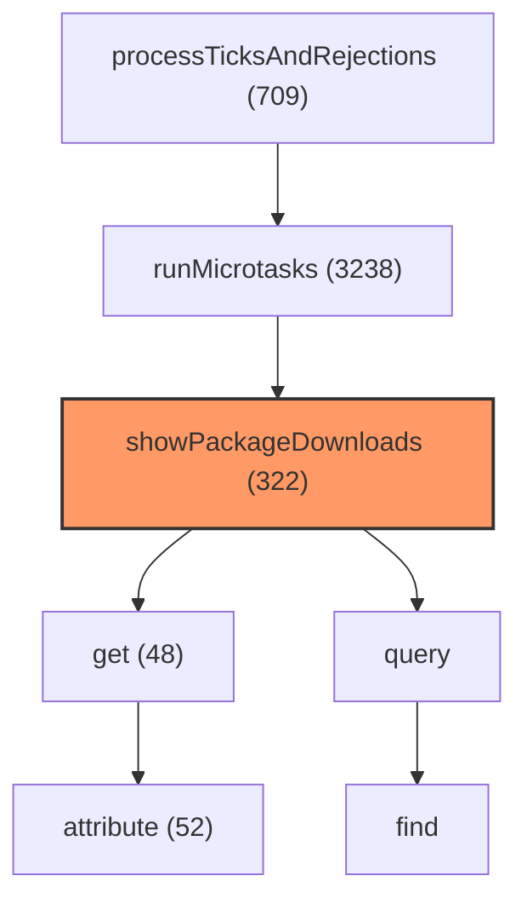
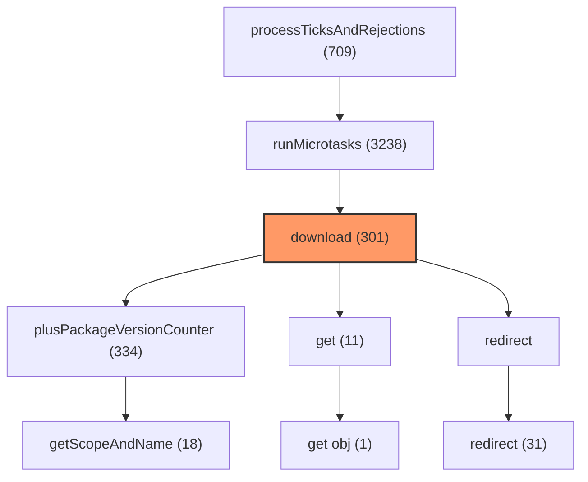
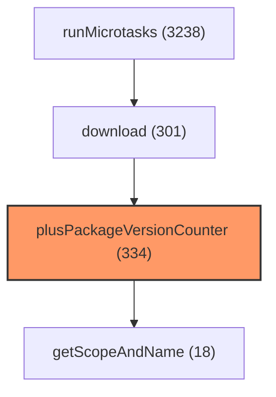
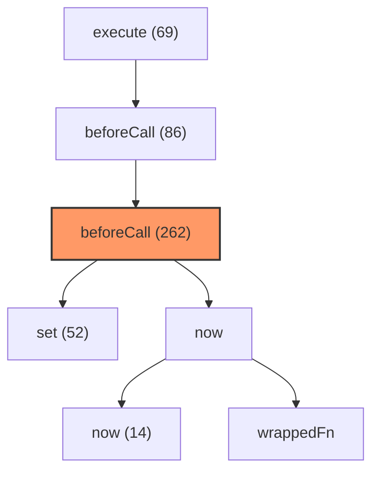
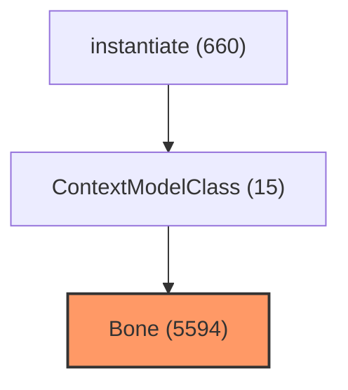
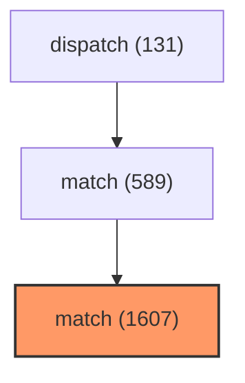
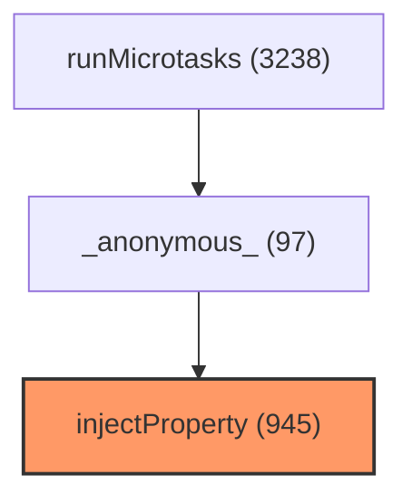
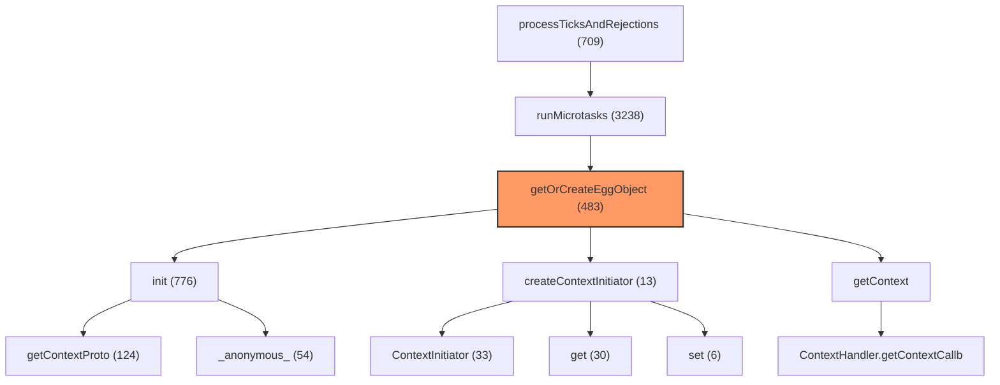
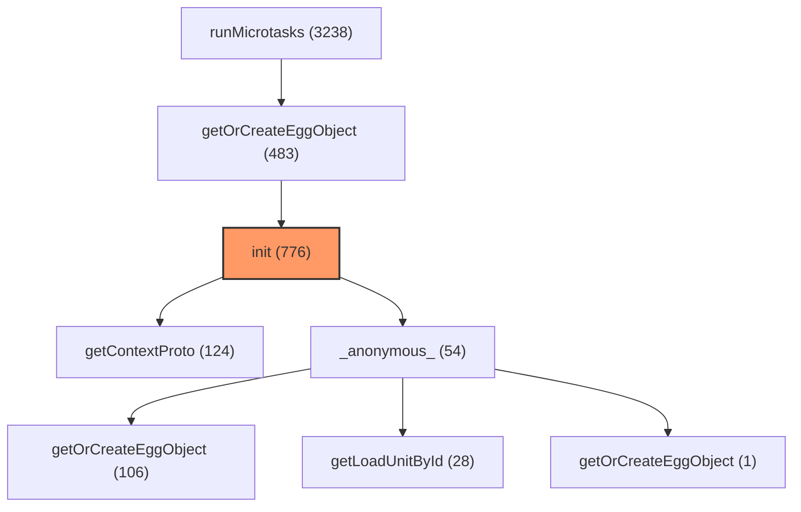

# Call Relationship Diagrams

## showPackageDownloads

### Call Tree

```
=== Callers (who calls this function) ===
← runMicrotasks [:0]
  ← processTicksAndRejections [node:internal/process/task_queues:71]

=== showPackageDownloads [app/port/controller/DownloadController.j:20] (hitCount: 322) ===

=== Callees (what this function calls) ===
→ get [_leoric@2.14.0@leoric/lib/bone.js:1168] (hits: 48)
  → attribute [_leoric@2.14.0@leoric/lib/bone.js:199] (hits: 52)
    → __classPrivateFieldGet [_tslib@2.8.1@tslib/tslib.js:336] (hits: 84)
→ query [app/repository/PackageVersionDownloadRep:36] (hits: 0)
  → find [_leoric@2.14.0@leoric/lib/bone.js:1333] (hits: 0)
    → _find [_leoric@2.14.0@leoric/lib/bone.js:1343] (hits: 0)
      → Spell [_leoric@2.14.0@leoric/lib/spell.js:325] (hits: 0)
        → parseExpr [_leoric@2.14.0@leoric/lib/expr.js:442] (hits: 0)
      → $where [_leoric@2.14.0@leoric/lib/spell.js:589] (hits: 0)
        → parseConditions [_leoric@2.14.0@leoric/lib/spell.js:45] (hits: 0)
```

### Mermaid Diagram



## download

### Call Tree

```
=== Callers (who calls this function) ===
← runMicrotasks [:0]
  ← processTicksAndRejections [node:internal/process/task_queues:71]

=== download [app/port/controller/package/DownloadPack:26] (hitCount: 301) ===

=== Callees (what this function calls) ===
→ plusPackageVersionCounter [app/core/service/PackageManagerService.j:414] (hits: 334)
  → getScopeAndName [app/common/PackageUtil.js:13] (hits: 18)
→ get [_@eggjs_tegg-runtime@4.0.0-beta.35@@eggj:5] (hits: 11)
  → get obj [_@eggjs_tegg-runtime@4.0.0-beta.35@@eggj:168] (hits: 1)
→ redirect [_@eggjs_koa@3.1.0-beta.35@@eggjs/koa/dis:274] (hits: 0)
  → redirect [_@eggjs_security@5.0.0-beta.35@@eggjs/se:38] (hits: 31)
    → URL [node:internal/url:812] (hits: 23)
      → parse [:0] (hits: 141)
    → unsafeRedirect [_@eggjs_security@5.0.0-beta.35@@eggjs/se:19] (hits: 9)
      → redirect [_@eggjs_koa@3.1.0-beta.35@@eggjs/koa/dis:219] (hits: 331)
        → encodeUrl [_encodeurl@2.0.0@encodeurl/index.js:56] (hits: 282)
        → set body [_@eggjs_koa@3.1.0-beta.35@@eggjs/koa/dis:95] (hits: 74)
        → set type [_@eggjs_koa@3.1.0-beta.35@@eggjs/koa/dis:263] (hits: 62)
        → set [_@eggjs_koa@3.1.0-beta.35@@eggjs/koa/dis:376] (hits: 58)
        → escapeHtml [_escape-html@1.0.3@escape-html/index.js:33] (hits: 56)
```

### Mermaid Diagram



## plusPackageVersionCounter

### Call Tree

```
=== Callers (who calls this function) ===
← download [app/port/controller/package/DownloadPack:26]
  ← runMicrotasks [:0]
    ← processTicksAndRejections [node:internal/process/task_queues:71]

=== plusPackageVersionCounter [app/core/service/PackageManagerService.j:414] (hitCount: 334) ===

=== Callees (what this function calls) ===
→ getScopeAndName [app/common/PackageUtil.js:13] (hits: 18)
```

### Mermaid Diagram



## beforeCall

### Call Tree

```
=== Callers (who calls this function) ===
← beforeCall [_@eggjs_aop-runtime@4.0.0-beta.35@@eggjs:53]
  ← execute [_@eggjs_aop-runtime@4.0.0-beta.35@@eggjs:37]
    ← download [app/port/controller/package/DownloadPack:26]
      ←  [_@eggjs_controller-plugin@4.0.0-beta.35@:36]
        ← runMicrotasks [:0]

=== beforeCall [app/common/aop/AsyncTimer.js:17] (hitCount: 262) ===

=== Callees (what this function calls) ===
→ set [_@eggjs_aop-runtime@4.0.0-beta.35@@eggjs:16] (hits: 52)
→ now [node:internal/perf/performance:137] (hits: 0)
  → now [:0] (hits: 14)
  → wrappedFn [node:internal/errors:537] (hits: 0)
    →  [node:internal/validators:536] (hits: 5)
```

### Mermaid Diagram



## Bone

### Call Tree

```
=== Callers (who calls this function) ===
← ContextModelClass [_@eggjs_orm-plugin@4.0.0-beta.35@@eggjs/:17]
  ← instantiate [_leoric@2.14.0@leoric/lib/bone.js:1283]
    ← dispatch [_leoric@2.14.0@leoric/lib/collection.js:81]
      ← init [_leoric@2.14.0@leoric/lib/collection.js:13]
        ← ignite [_leoric@2.14.0@leoric/lib/spell.js:441]

=== Bone [_leoric@2.14.0@leoric/lib/bone.js:151] (hitCount: 5594) ===

=== Callees (what this function calls) ===
```

### Mermaid Diagram



## match

### Call Tree

```
=== Callers (who calls this function) ===
← match [_@eggjs_router@4.0.0-beta.35@@eggjs/rout:424]
  ← dispatch [_@eggjs_router@4.0.0-beta.35@@eggjs/rout:122]
    ← dispatch [_koa-compose@4.1.0@koa-compose/index.js:35]
      ← ctxLifecycleMiddleware [_@eggjs_tegg-plugin@4.0.0-beta.35@@eggjs:3]
        ← runMicrotasks [:0]

=== match [_@eggjs_router@4.0.0-beta.35@@eggjs/rout:72] (hitCount: 1607) ===

=== Callees (what this function calls) ===
```

### Mermaid Diagram



## injectProperty

### Call Tree

```
=== Callers (who calls this function) ===
←  [_@eggjs_tegg-runtime@4.0.0-beta.35@@eggj:40]
  ← runMicrotasks [:0]
    ← processTicksAndRejections [node:internal/process/task_queues:71]

=== injectProperty [_@eggjs_tegg-runtime@4.0.0-beta.35@@eggj:165] (hitCount: 945) ===

=== Callees (what this function calls) ===
```

### Mermaid Diagram



## getOrCreateEggObject

### Call Tree

```
=== Callers (who calls this function) ===
← runMicrotasks [:0]
  ← processTicksAndRejections [node:internal/process/task_queues:71]

=== getOrCreateEggObject [_@eggjs_tegg-runtime@4.0.0-beta.35@@eggj:28] (hitCount: 483) ===

=== Callees (what this function calls) ===
→ init [_@eggjs_tegg-runtime@4.0.0-beta.35@@eggj:13] (hits: 776)
  → getContextProto [_@eggjs_tegg-runtime@4.0.0-beta.35@@eggj:19] (hits: 124)
  →  [_@eggjs_tegg-runtime@4.0.0-beta.35@@eggj:19] (hits: 54)
    → getOrCreateEggObject [_@eggjs_tegg-runtime@4.0.0-beta.35@@eggj:28] (hits: 106)
      → getOrCreateEggObject [_@eggjs_tegg-runtime@4.0.0-beta.35@@eggj:51] (hits: 111)
        → createObject [_@eggjs_tegg-runtime@4.0.0-beta.35@@eggj:17] (hits: 76)
        → getOrStore [_@eggjs_tegg-common-util@4.0.0-beta.35@@:2] (hits: 36)
      → getContainer [_@eggjs_tegg-runtime@4.0.0-beta.35@@eggj:16] (hits: 15)
        →  [_@eggjs_tegg-runtime@4.0.0-beta.35@@eggj:85] (hits: 6)
    → getLoadUnitById [_@eggjs_metadata@4.0.0-beta.35@@eggjs/me:52] (hits: 28)
    → getOrCreateEggObject [_@eggjs_tegg-runtime@4.0.0-beta.35@@eggj:51] (hits: 1)
→ createContextInitiator [_@eggjs_tegg-runtime@4.0.0-beta.35@@eggj:28] (hits: 13)
  → ContextInitiator [_@eggjs_tegg-runtime@4.0.0-beta.35@@eggj:8] (hits: 33)
    → set [_@eggjs_tegg-runtime@4.0.0-beta.35@@eggj:81] (hits: 4)
  → get [_@eggjs_tegg-runtime@4.0.0-beta.35@@eggj:38] (hits: 30)
  → set [_@eggjs_tegg-runtime@4.0.0-beta.35@@eggj:81] (hits: 6)
→ getContext [_@eggjs_tegg-runtime@4.0.0-beta.35@@eggj:5] (hits: 0)
  → ContextHandler.getContextCallback [_@eggjs_tegg-plugin@4.0.0-beta.35@@eggjs:17] (hits: 0)
    → getContextCallback [_@eggjs_tegg-plugin@4.0.0-beta.35@@eggjs:8] (hits: 78)
      → get teggContext [_@eggjs_tegg-plugin@4.0.0-beta.35@@eggjs:9] (hits: 17)
      → get currentContext [_egg@4.1.0-beta.35@egg/dist/lib/egg.js:41] (hits: 0)
        → getStore [node:internal/async_local_storage/async_:73] (hits: 17)
```

### Mermaid Diagram



## init

### Call Tree

```
=== Callers (who calls this function) ===
← getOrCreateEggObject [_@eggjs_tegg-runtime@4.0.0-beta.35@@eggj:28]
  ← runMicrotasks [:0]
    ← processTicksAndRejections [node:internal/process/task_queues:71]

=== init [_@eggjs_tegg-runtime@4.0.0-beta.35@@eggj:13] (hitCount: 776) ===

=== Callees (what this function calls) ===
→ getContextProto [_@eggjs_tegg-runtime@4.0.0-beta.35@@eggj:19] (hits: 124)
→  [_@eggjs_tegg-runtime@4.0.0-beta.35@@eggj:19] (hits: 54)
  → getOrCreateEggObject [_@eggjs_tegg-runtime@4.0.0-beta.35@@eggj:28] (hits: 106)
    → getOrCreateEggObject [_@eggjs_tegg-runtime@4.0.0-beta.35@@eggj:51] (hits: 111)
      → createObject [_@eggjs_tegg-runtime@4.0.0-beta.35@@eggj:17] (hits: 76)
        → getLoadUnitInstance [_@eggjs_tegg-runtime@4.0.0-beta.35@@eggj:32] (hits: 170)
        → createObject [_@eggjs_tegg-runtime@4.0.0-beta.35@@eggj:174] (hits: 40)
        → getEggObjectCreateMethod [_@eggjs_tegg-runtime@4.0.0-beta.35@@eggj:11] (hits: 13)
      → getOrStore [_@eggjs_tegg-common-util@4.0.0-beta.35@@:2] (hits: 36)
    → getContainer [_@eggjs_tegg-runtime@4.0.0-beta.35@@eggj:16] (hits: 15)
      →  [_@eggjs_tegg-runtime@4.0.0-beta.35@@eggj:85] (hits: 6)
        → getContext [_@eggjs_tegg-runtime@4.0.0-beta.35@@eggj:5] (hits: 0)
  → getLoadUnitById [_@eggjs_metadata@4.0.0-beta.35@@eggjs/me:52] (hits: 28)
  → getOrCreateEggObject [_@eggjs_tegg-runtime@4.0.0-beta.35@@eggj:51] (hits: 1)
```

### Mermaid Diagram


