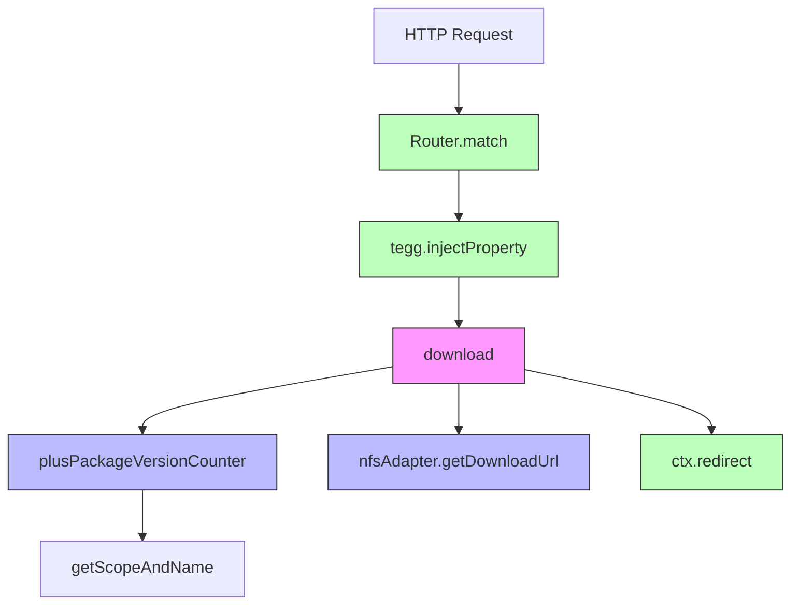
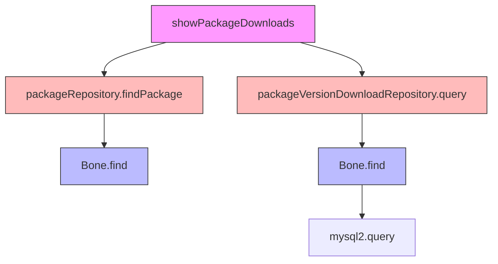
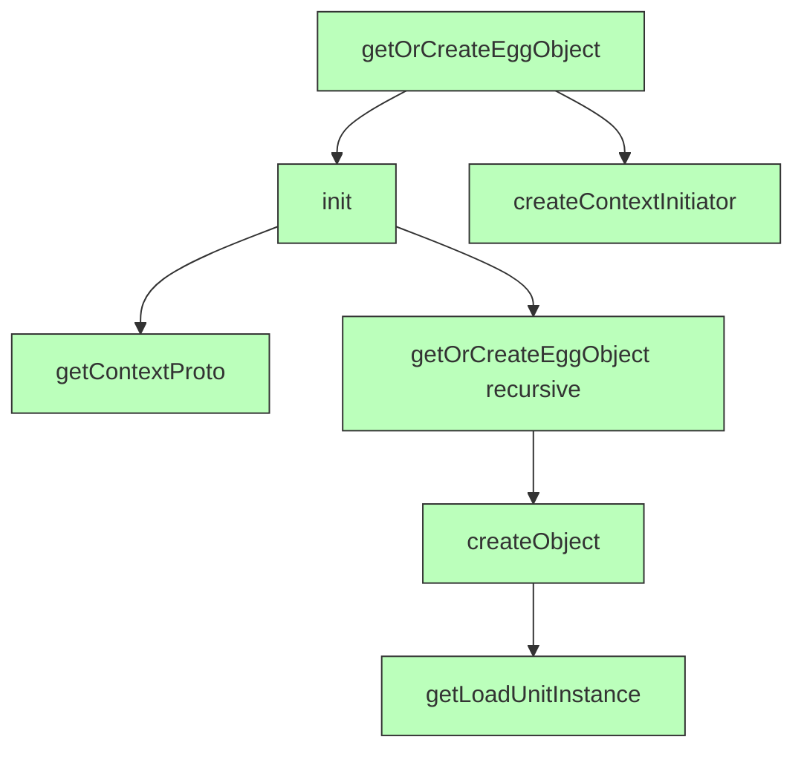

# cnpmcore 4.18.0 CPU Profile Analysis Report

**Generated:** 2025-12-30
**Profile Duration:** ~360 seconds (2 profiles × 180s each)
**Total Samples:** 306,154

## Executive Summary

This report analyzes CPU profiling data from cnpmcore 4.18.0 running on registry.npmmirror.com production servers. Two CPU profiles were captured from different pods (registry.npmmirror.com-05 and registry.npmmirror.com-08), each spanning approximately 180 seconds.

### Key Findings

1. **High Idle Time (49.6%)**: Almost half the CPU time is idle, indicating the service is I/O bound rather than CPU bound
2. **Leoric ORM Overhead (5.4%)**: The database ORM layer consumes the most CPU among dependencies
3. **Tegg DI Framework Overhead (4.16%)**: Dependency injection runtime has significant overhead
4. **Router Matching (2.39%)**: Route matching consumes notable CPU time
5. **Application Code (1.61%)**: cnpmcore's own code is relatively efficient

## CPU Time Distribution

### By Category

| Category                 | Self Time % | Description                    |
| ------------------------ | ----------- | ------------------------------ |
| Idle                     | 49.61%      | Event loop waiting for I/O     |
| Unknown (native)         | 10.59%      | V8 internal operations         |
| Node.js Internal         | 10.71%      | Node.js core modules           |
| leoric (ORM)             | 5.40%       | Database ORM operations        |
| @eggjs/tegg-runtime      | 4.16%       | Dependency injection framework |
| @eggjs/router            | 2.39%       | HTTP request routing           |
| @eggjs/lifecycle         | 1.88%       | Object lifecycle management    |
| **cnpmcore app**         | **1.61%**   | **Application business logic** |
| mysql2                   | 1.54%       | MySQL driver                   |
| @eggjs/koa               | 1.32%       | Koa web framework              |
| egg-logger               | 1.26%       | Logging infrastructure         |
| @eggjs/controller-plugin | 1.19%       | Controller framework           |
| @eggjs/aop-runtime       | 1.04%       | AOP aspect execution           |
| reflect-metadata         | 0.88%       | Reflection for decorators      |

### Framework Overhead Analysis

The Egg.js/Tegg framework stack accounts for approximately **12%** of CPU time:

```
@eggjs/tegg-runtime     4.16%
@eggjs/router           2.39%
@eggjs/lifecycle        1.88%
@eggjs/koa              1.32%
@eggjs/controller-plugin 1.19%
@eggjs/aop-runtime      1.04%
----------------------------
Total Framework         ~12%
```

## Top 30 Hotspot Functions

| #   | Function                    | Category           | Self % | Location                  |
| --- | --------------------------- | ------------------ | ------ | ------------------------- |
| 1   | `(idle)`                    | native             | 49.61% | -                         |
| 2   | `Bone` (constructor)        | leoric             | 2.49%  | bone.js:151               |
| 3   | `(program)`                 | native             | 2.02%  | -                         |
| 4   | `runMicrotasks`             | native             | 1.81%  | -                         |
| 5   | `writev`                    | native             | 1.48%  | -                         |
| 6   | `(garbage collector)`       | native             | 1.11%  | -                         |
| 7   | `_addHeaderLine`            | node:http          | 1.04%  | \_http_incoming:382       |
| 8   | `match` (Layer)             | router             | 1.00%  | Layer.js:72               |
| 9   | `writeUtf8String`           | native             | 0.98%  | -                         |
| 10  | `(anonymous)`               | router             | 0.74%  | Router.js:137             |
| 11  | `injectProperty`            | tegg-runtime       | 0.59%  | EggObjectImpl.js:165      |
| 12  | `(anonymous)`               | controller-plugin  | 0.55%  | HTTPMethodRegister.js:160 |
| 13  | `parseChannelMessages`      | node:serialization | 0.53%  | serialization:142         |
| 14  | `init`                      | tegg-runtime       | 0.48%  | ContextInitiator.js:13    |
| 15  | `initWithInjectProperty`    | tegg-runtime       | 0.44%  | EggObjectImpl.js:20       |
| 16  | `getLifecycleHook`          | lifecycle          | 0.43%  | LifycycleUtil.js:72       |
| 17  | `close`                     | native             | 0.42%  | -                         |
| 18  | `createCallContext`         | aop-runtime        | 0.38%  | AspectExecutor.js:20      |
| 19  | `processTicksAndRejections` | node:internal      | 0.36%  | task_queues:71            |
| 20  | `get` (column)              | mysql2             | 0.35%  | column_definition.js:263  |

## cnpmcore Application Code Hotspots

These are the CPU-intensive functions within the cnpmcore application code:

| #   | Function                    | Self % | Source File                  | Line |
| --- | --------------------------- | ------ | ---------------------------- | ---- |
| 1   | `showPackageDownloads`      | 0.260% | DownloadController.ts        | 20   |
| 2   | `plusPackageVersionCounter` | 0.192% | PackageManagerService.ts     | 522  |
| 3   | `beforeCall`                | 0.159% | AsyncTimer.ts                | 15   |
| 4   | `download`                  | 0.098% | DownloadPackageVersionTar.ts | 45   |

### Analysis of App Code Hotspots

#### 1. showPackageDownloads (0.26%)

**File:** `app/port/controller/DownloadController.ts:20`

This function handles download statistics queries. The hotspot is in processing download data from the database:

```typescript
async showPackageDownloads(@HTTPParam() fullname: string, @HTTPParam() range: string) {
  // Iterates through 31 days × multiple entities
  for (const entity of entities) {
    for (let i = 1; i <= 31; i++) {
      // Field access pattern: d01, d02, ... d31
      const field = `d${day}` as keyof typeof entity;
      const counter = entity[field] as number;
      // ...
    }
  }
}
```

**Potential Optimization:** Consider pre-aggregating download statistics or using database-level aggregation.

#### 2. plusPackageVersionCounter (0.19%)

**File:** `app/core/service/PackageManagerService.ts:522`

This function increments download counters in memory. It's called on every package download:

```typescript
public plusPackageVersionCounter(fullname: string, version: string) {
  const counters = PackageManagerService.downloadCounters;
  if (!counters[fullname]) counters[fullname] = {};
  counters[fullname][version] = (counters[fullname][version] || 0) + 1;
  // Also updates total and scope counters
}
```

**Analysis:** This function is efficient (O(1) hash operations), but called very frequently. The overhead is mainly from:

- Object property creation/access
- `getScopeAndName` string parsing

#### 3. beforeCall (AsyncTimer AOP) (0.16%)

**File:** `app/common/aop/AsyncTimer.ts:15`

This AOP advice runs before every async method call:

```typescript
async beforeCall(ctx: AdviceContext) {
  ctx.set(START, performance.now());
  ctx.set(SUCCEED, true);
}
```

**Potential Optimization:** Consider making this optional in production or sampling-based.

#### 4. download (0.10%)

**File:** `app/port/controller/package/DownloadPackageVersionTar.ts:45`

The main download handler. Most time is spent in async I/O (not shown in self-time).

## Call Relationship Diagrams

### Package Download Flow



### Download Statistics Query Flow



### Dependency Injection Flow (per-request)



## Optimization Recommendations

### High Impact

1. **Leoric ORM (5.4%)**
   - The `Bone` constructor is the hottest non-idle function
   - Consider:
     - Implementing object pooling for frequently accessed entities
     - Using raw SQL for hot paths
     - Enabling query result caching

2. **Route Matching (2.39%)**
   - Router `match` function runs on every request
   - Consider:
     - Reviewing route patterns for efficiency
     - Pre-compiling route patterns if not already done
     - Using route caching for repeated patterns

3. **Dependency Injection Overhead (4.16%)**
   - `injectProperty`, `init`, `getOrCreateEggObject` are frequent
   - Consider:
     - Using singleton scope where possible
     - Reducing per-request object creation
     - Lazy initialization for rarely used dependencies

### Medium Impact

4. **AsyncTimer AOP (0.16%)**
   - Runs on every async method call
   - Consider:
     - Making it sampling-based in production
     - Using conditional enablement

5. **Download Counter (0.19%)**
   - Called on every package download
   - Current implementation is already efficient
   - Consider batching updates to reduce call frequency

### Low Impact (but worth noting)

6. **Garbage Collection (1.11%)**
   - Indicates normal memory pressure
   - Monitor for spikes during high traffic

7. **HTTP Header Parsing (1.04%)**
   - Node.js internal overhead
   - Consider reducing unnecessary headers

## Files for Further Investigation

These files/locations warrant closer examination:

| File                          | CPU % | Reason                  |
| ----------------------------- | ----- | ----------------------- |
| leoric/lib/bone.js:151        | 2.99% | ORM entity constructor  |
| tegg-runtime/EggObjectImpl.js | 1.03% | DI property injection   |
| router/Router.js              | 1.03% | Route matching logic    |
| router/Layer.js:72            | 1.00% | Layer matching          |
| HTTPMethodRegister.js         | 0.86% | Controller registration |
| ContextInitiator.js:13        | 0.48% | Context initialization  |
| LifycycleUtil.js:72           | 0.43% | Lifecycle hooks         |
| AspectExecutor.js:20          | 0.38% | AOP execution           |

## Conclusion

cnpmcore 4.18.0's CPU profile shows that:

1. **The application code is efficient** - Only 1.61% of CPU time is spent in cnpmcore's own code
2. **Framework overhead is significant** - The Egg.js/Tegg stack accounts for ~12% of CPU time
3. **Database ORM is the main dependency hotspot** - Leoric consumes 5.4% of CPU time
4. **The service is I/O bound** - 49.6% idle time indicates waiting for database/network I/O

The main optimization opportunities lie in:

- Reducing ORM overhead (object creation, query optimization)
- Optimizing dependency injection patterns
- Considering route matching efficiency

---

## Appendix: Analysis Scripts

The following scripts were used for this analysis and are saved in this directory:

1. `analyze-cpuprofile.mjs` - Main analysis script
2. `generate-call-graph.mjs` - Call relationship diagram generator
3. `find-app-hotspots.mjs` - Application code hotspot finder

### Usage

```bash
# Run main analysis
node benchmark/profiler-4.18.0/analyze-cpuprofile.mjs

# Generate call graphs
node benchmark/profiler-4.18.0/generate-call-graph.mjs

# Find app-specific hotspots
node benchmark/profiler-4.18.0/find-app-hotspots.mjs
```

Environment variables:

- `PROFILE_DIR`: Directory containing cpuprofile files (default: ~/Downloads/cnpmcore/4.18.0)
- `OUTPUT_DIR`: Output directory for reports (default: script directory)
- `CNPMCORE_ROOT`: Path to cnpmcore source code (default: ~/git/github.com/cnpm/cnpmcore)
