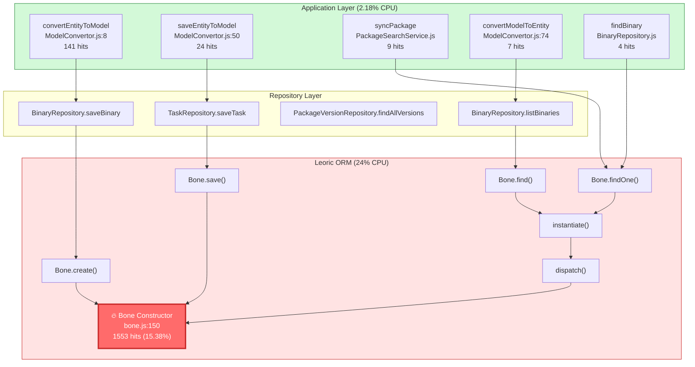

# Application → Leoric Bone Call Relationship Diagram

## Summary

The Leoric `Bone` constructor (15.38% of CPU) is called through these application layer entry points:

| Rank | Application Entry Point          | Hits | File                           |
| ---- | -------------------------------- | ---- | ------------------------------ |
| 1    | `convertEntityToModel`           | 141  | ModelConvertor.js:8            |
| 2    | `saveEntityToModel`              | 24   | ModelConvertor.js:50           |
| 3    | `syncPackage`                    | 9    | PackageSearchService.js:16     |
| 4    | `(anonymous)` in findAllVersions | 8    | PackageVersionRepository.js:57 |
| 5    | `convertModelToEntity`           | 7    | ModelConvertor.js:74           |
| 6    | `findBinary`                     | 4    | BinaryRepository.js:27         |

**Note**: 1,743 hits (most of the Bone calls) come from paths without direct application code - triggered by async operations and internal leoric queries.

## Call Flow Diagram



## Detailed Call Paths

### Path 1: Entity Creation (141 hits - Highest)

```
BinarySyncerService.saveBinaryItem()
    └── BinaryRepository.saveBinary()
        └── ModelConvertor.convertEntityToModel()
            └── Bone.create()
                └── ContextModelClass()
                    └── 🔥 Bone() constructor [132 hits]
```

**This is the hottest path.** Every time a new entity is saved to the database, the `Bone` constructor is called.

### Path 2: Entity Update (24 hits)

```
ChangesStreamService / TaskService
    └── TaskRepository.saveTask()
        └── ModelConvertor.saveEntityToModel()
            └── Bone.save()
                └── Bone._save()
                    └── Bone.update()
                        └── Bone._update() [7 hits]
                    └── Bone.changes()
                        └── deep-equal checks [expensive]
```

### Path 3: Database Query Results (1553+ hits - Main Hotspot)

```
Any Repository.find*() method
    └── Leoric Spell.then()
        └── ignite()
            └── dispatch()
                └── instantiate()
                    └── ContextModelClass()
                        └── 🔥 Bone() constructor [1553 hits]
```

**This is where most CPU time is spent.** Every row returned from the database triggers a `Bone` constructor call to instantiate the ORM model.

## Root Cause Analysis

The `Bone` constructor is expensive because it:

1. **Initializes all attribute accessors** - Creates getters/setters for each column
2. **Sets up change tracking** - Prepares for dirty checking
3. **Validates attributes** - Runs type checking on initialization
4. **Uses deep-equal** - Expensive comparison for change detection

## Optimization Recommendations

### 1. Batch Operations

When inserting many records, use bulk insert instead of individual creates:

```typescript
// Instead of:
for (const entity of entities) {
  await Model.create(entity); // Each calls Bone constructor
}

// Use:
await Model.bulkCreate(entities); // Single operation
```

### 2. Raw Queries for Read-Heavy Operations

For read operations that don't need full ORM features:

```typescript
// Instead of:
const records = await Model.find({ where: {...} });  // Creates Bone instances

// Consider:
const records = await Model.query('SELECT * FROM ...', { raw: true });  // Plain objects
```

### 3. Select Only Needed Columns

```typescript
// Instead of:
await Model.findOne({ where: {...} });  // Loads all columns

// Use:
await Model.findOne({ where: {...}, select: ['id', 'name'] });  // Fewer attributes to initialize
```

### 4. Consider Leoric Configuration

Check if leoric has options to:

- Disable change tracking for read-only queries
- Use lazy attribute initialization
- Skip validation on trusted data

## Files to Review

1. `app/repository/util/ModelConvertor.ts` - Main entity/model conversion
2. `app/repository/BinaryRepository.ts` - Heavy on creates
3. `app/core/service/BinarySyncerService.ts` - Triggers many entity creations
4. Any repository with high query volume
